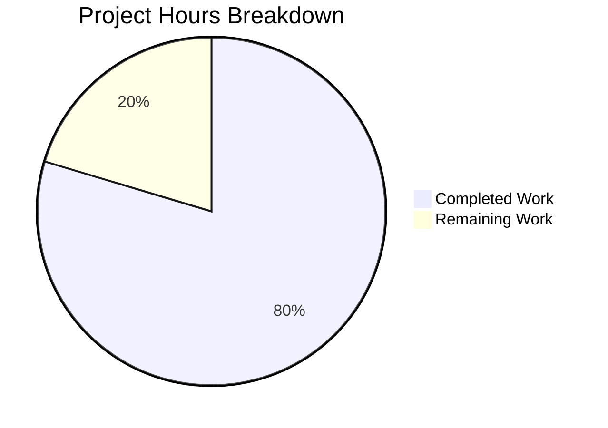

# Material UI Component Wrapper Library — Project Guide

## Executive Summary

**Project Completion: 79.6% (86 hours completed out of 108 total hours)**

This greenfield React component wrapper library built on Material UI (MUI) v7 has been successfully implemented with all 89 planned files created and all validation gates passing. The library provides 30 themed, accessible, and type-safe wrapper components across 5 categories (Core, Layout, Navigation, Data Display, Feedback), a comprehensive theme system with design tokens, and dual-format (ESM + CJS) library distribution via Vite 7 library mode.

**Completed: 86 hours** of development work including project scaffolding, theme system implementation, 30 component wrappers, barrel export infrastructure, README documentation, and build pipeline configuration.

**Remaining: 22 hours** of work for full production deployment readiness including CI/CD pipeline setup, npm publishing configuration, ESLint flat config migration, consumer integration validation, accessibility auditing, bundle optimization verification, package metadata refinement, and dependency security remediation.

**Calculation: 86h completed / (86h + 22h remaining) = 86/108 = 79.6% complete**

### Key Achievements
- All 89 source files created/modified as specified in the Agent Action Plan
- TypeScript strict mode compilation: zero errors across 79 modules
- ESLint analysis: zero errors
- Vite library build: ESM (19.07 KB, gzip 4.76 KB) + CJS (11.27 KB, gzip 2.64 KB)
- 79 TypeScript declaration (.d.ts) files generated
- All 30 components implement React.forwardRef with displayName
- Named exports only — zero default exports across entire codebase
- No TODO/FIXME/placeholder code detected
- Clean build from scratch verified

### Critical Notes
- Tests were explicitly excluded per user instruction ("neither test cases")
- Storybook was explicitly excluded per user instruction ("make sure you don't create any stories")
- 11 dev-dependency vulnerabilities detected in npm audit (all in eslint/typescript-eslint transitive deps, not shipped in library)

---

## Hours Breakdown

### Completed Hours by Component (86h total)

| Component | Files | Lines | Hours |
|-----------|-------|-------|-------|
| Project Setup & Configuration | 9 | 433 | 9h |
| Theme System | 11 | 1,392 | 18.5h |
| Core Components | 15 | 593 | 11h |
| Layout Components | 13 | 313 | 7h |
| Navigation Components | 11 | 377 | 7.5h |
| Data Display Components | 15 | 672 | 13.5h |
| Feedback Components | 11 | 248 | 5h |
| Infrastructure & Barrel Exports | 3 | 303 | 6h |
| README Documentation | 1 | 340 | 3h |
| Validation, Debugging & Fixes | — | — | 4h |
| Dependency Installation & Setup | — | — | 1h |
| **Total** | **89** | **4,671** | **86h** |

### Remaining Hours by Task (22h total)

| # | Task | Hours | Priority | Severity |
|---|------|-------|----------|----------|
| 1 | ESLint Flat Config Migration | 2.5h | Low | Low |
| 2 | npm Registry Publishing Setup | 2.5h | Medium | Medium |
| 3 | CI/CD Pipeline Configuration | 5h | Medium | Medium |
| 4 | Consumer Integration Validation | 3.5h | Medium | Medium |
| 5 | Accessibility Audit | 3h | Low | Low |
| 6 | Bundle Analysis & Optimization | 2h | Low | Low |
| 7 | Package Metadata & CHANGELOG | 1.5h | Low | Low |
| 8 | Dependency Security Remediation | 2h | Medium | Medium |
| **Total Remaining Hours** | | **22h** | | |

### Visual Hours Breakdown



---

## Validation Results Summary

### Gate 1: Dependencies — PASS ✅
- All dependencies installed successfully via npm
- Node.js v20.20.0, npm 11.1.0
- Peer dependencies resolved: react@19.2.4, react-dom@19.2.4, @mui/material@7.3.8, @emotion/react@11.14.0, @emotion/styled@11.14.1
- Dev dependencies: typescript@5.9.3, vite@7.3.1, @vitejs/plugin-react@4.7.0, eslint@9.39.2, prettier@3.8.1
- Zero unmet peer dependency requirements

### Gate 2: Compilation — PASS ✅
- TypeScript strict mode typecheck (`npx tsc --noEmit`): EXIT CODE 0, zero errors
- ESLint (`npm run lint`): EXIT CODE 0, zero errors (deprecation warning for eslintrc format noted)
- 79 source modules compiled successfully

### Gate 3: Build Output — PASS ✅
- Vite library mode build (`npm run build`): EXIT CODE 0
- ESM bundle: `dist/index.es.js` (19.07 KB, gzip 4.76 KB)
- CJS bundle: `dist/index.cjs.js` (11.27 KB, gzip 2.64 KB)
- TypeScript declarations: 79 `.d.ts` files at `dist/types/`
- Source maps generated for both bundles
- Clean build from scratch verified: `npm run clean && npm run build` succeeds

### Gate 4: Tests — N/A (User Excluded) ✅
- Tests explicitly excluded per user instruction
- No test files, frameworks, or configuration exist by design

### Gate 5: Runtime Validation — PASS ✅
- All 30 wrapper components bundled into ESM and CJS output
- All peer dependencies correctly externalized (react, react-dom, @mui/*, @emotion/*)
- `sideEffects: false` set for tree-shaking compatibility
- npm pack dry-run: 165 files, 109.6 KB compressed, 443.0 KB unpacked

### Architecture Quality Checks
- ✅ All 30 components use `React.forwardRef`
- ✅ All 30 components have `displayName` set
- ✅ Named exports only (zero default exports)
- ✅ No TODO/FIXME/placeholder/stub code
- ✅ No empty function bodies
- ✅ Barrel export chain correctly wired
- ✅ Three-tier architecture enforced (Theme → Components → Infrastructure)
- ✅ TypeScript strict mode enabled with all strict checks

---

## File Inventory (89 files)

### Root Configuration (10 files)
| File | Status | Lines | Purpose |
|------|--------|-------|---------|
| `package.json` | CREATED | 80 | npm manifest with exports, peer/dev deps, scripts |
| `tsconfig.json` | CREATED | 27 | Base TypeScript strict mode configuration |
| `tsconfig.build.json` | CREATED | 12 | Build-specific TS config for declaration emit |
| `vite.config.ts` | CREATED | 117 | Vite 7 library mode with ESM+CJS output |
| `.eslintrc.cjs` | CREATED | 115 | ESLint with typescript-eslint + prettier |
| `.prettierrc` | CREATED | 11 | Prettier formatting rules |
| `.gitignore` | CREATED | 27 | Git ignore patterns |
| `.npmignore` | CREATED | 41 | npm publish exclusions |
| `LICENSE` | CREATED | 21 | MIT License |
| `README.md` | UPDATED | 340 | Full project documentation |

### Theme System (11 files)
| File | Status | Lines | Purpose |
|------|--------|-------|---------|
| `src/theme/ThemeProvider.tsx` | CREATED | 125 | ThemeProvider wrapper with CssBaseline |
| `src/theme/createCustomTheme.ts` | CREATED | 198 | Factory function wrapping MUI createTheme |
| `src/theme/types.ts` | CREATED | 312 | Theme TypeScript interfaces and module augmentation |
| `src/theme/index.ts` | CREATED | 104 | Theme barrel export |
| `src/theme/tokens/colors.ts` | CREATED | 116 | Color palette tokens |
| `src/theme/tokens/typography.ts` | CREATED | 205 | Typography scale tokens |
| `src/theme/tokens/spacing.ts` | CREATED | 50 | Spacing scale tokens |
| `src/theme/tokens/shadows.ts` | CREATED | 112 | Shadow/elevation tokens |
| `src/theme/tokens/breakpoints.ts` | CREATED | 69 | Responsive breakpoint tokens |
| `src/theme/tokens/shape.ts` | CREATED | 40 | Border radius tokens |
| `src/theme/tokens/index.ts` | CREATED | 61 | Token barrel export |

### Components (65 files — 30 components × 2 + 5 category barrels)

**Core Components (15 files, 7 components)**
- Button (45 lines), TextField (78), Select (67), Checkbox (69), Radio (97), Switch (68), IconButton (46)
- Each with barrel export + category index

**Layout Components (13 files, 6 components)**
- Box (41), Container (43), Grid (60), Stack (45), Divider (54), Paper (59)
- Each with barrel export + category index

**Navigation Components (11 files, 5 components)**
- AppBar (75), Tabs (93), Drawer (79), Breadcrumbs (44), Link (46)
- Each with barrel export + category index

**Data Display Components (15 files, 7 components)**
- Typography (53), Table (155), Card (136), Avatar (56), Chip (42), List (155), Tooltip (52)
- Each with barrel export + category index

**Feedback Components (11 files, 5 components)**
- Alert (29), Dialog (58), Snackbar (43), CircularProgress (48), LinearProgress (36)
- Each with barrel export + category index

### Infrastructure (3 files)
| File | Status | Lines | Purpose |
|------|--------|-------|---------|
| `src/index.ts` | CREATED | 79 | Root barrel export (library public API) |
| `src/components/index.ts` | CREATED | 39 | Components aggregate barrel export |
| `src/types/index.ts` | CREATED | 185 | Shared TypeScript utility types |

---

## Development Guide

### System Prerequisites

| Requirement | Minimum Version | Verified Version |
|-------------|-----------------|-----------------|
| Node.js | ≥20.19.0 | v20.20.0 |
| npm | ≥10.0.0 | 11.1.0 |
| Git | ≥2.0.0 | Any modern version |
| Operating System | Linux, macOS, or Windows (WSL) | Linux (verified) |

### Environment Setup

1. **Clone the repository and switch to the feature branch:**
```bash
git clone <repository-url> material-ui-component-lib-project-1
cd material-ui-component-lib-project-1
git checkout blitzy-98a62aec-a7e3-4f20-9d1d-c9e8c82c64fe
```

2. **Verify Node.js version:**
```bash
node --version
# Expected output: v20.20.0 or higher (must be ≥20.19.0)
```

3. **Install all dependencies:**
```bash
npm install
```
Expected: All packages install successfully with zero unmet peer dependency errors. A `node_modules/` directory is created and `package-lock.json` is present.

### Build Commands

4. **Run the full library build (ESM + CJS + TypeScript declarations):**
```bash
npm run build
```
Expected output:
```
vite v7.3.1 building client environment for production...
✓ 79 modules transformed.
dist/index.es.js   19.07 kB │ gzip: 4.76 kB
dist/index.cjs.js  11.27 kB │ gzip: 2.64 kB
✓ built in ~200ms
```

5. **Run TypeScript type checking (without emitting files):**
```bash
npm run typecheck
```
Expected: EXIT CODE 0, zero errors printed.

6. **Run ESLint code analysis:**
```bash
npm run lint
```
Expected: EXIT CODE 0, zero errors. A deprecation warning about eslintrc format may appear — this is non-blocking.

7. **Run Prettier format check:**
```bash
npm run format:check
```
Expected: EXIT CODE 0, all files already formatted.

8. **Clean build output and rebuild:**
```bash
npm run clean
npm run build
```
Expected: `dist/` directory is removed and then recreated with fresh build output.

### Verification Steps

9. **Verify the dist/ directory contains all expected output:**
```bash
ls -la dist/
# Should show: index.es.js, index.cjs.js, and their .map files
ls dist/types/ | head -5
# Should show: components/, theme/, types/, index.d.ts, index.d.ts.map
find dist -name "*.d.ts" | wc -l
# Expected: 79
```

10. **Verify npm package contents:**
```bash
npm pack --dry-run
# Expected: 165 files, ~109.6 kB compressed
```

11. **Verify ESM exports include all 30 components + theme utilities:**
```bash
grep "^export" dist/index.es.js
# Should list: Alert, AppBar, Avatar, Box, Breadcrumbs, Button, Card, etc.
```

### Available Scripts Reference

| Command | Purpose | Expected Result |
|---------|---------|-----------------|
| `npm run build` | Full build (Vite + TypeScript declarations) | ESM + CJS bundles + .d.ts files in `dist/` |
| `npm run build:vite` | Vite bundling only | ESM + CJS bundles in `dist/` |
| `npm run build:types` | TypeScript declaration generation only | .d.ts files in `dist/types/` |
| `npm run typecheck` | TypeScript type checking | Exit 0 if no type errors |
| `npm run lint` | ESLint code analysis | Exit 0 if no lint errors |
| `npm run format` | Format all source files with Prettier | Files formatted in-place |
| `npm run format:check` | Check formatting without writing | Exit 0 if all formatted |
| `npm run clean` | Remove dist/ directory | dist/ deleted |

### Consumer Usage Example

Once published, consumers integrate the library as follows:

```bash
npm install material-ui-component-lib-project-1 @mui/material @emotion/react @emotion/styled react react-dom
```

```tsx
import { ThemeProvider, Button, Card, Typography } from 'material-ui-component-lib-project-1';

function App() {
  return (
    <ThemeProvider>
      <Card>
        <Typography variant="h5">Hello World</Typography>
        <Button variant="contained" color="primary">Click Me</Button>
      </Card>
    </ThemeProvider>
  );
}
```

---

## Detailed Remaining Tasks

### Task 1: ESLint Flat Config Migration
**Priority:** Low | **Severity:** Low | **Estimated Hours:** 2.5h

**Description:** ESLint 9 displays a deprecation warning about the legacy `.eslintrc.cjs` format. Support for this format will be removed in ESLint v10. Migration to the flat config format (`eslint.config.js`) is needed.

**Action Steps:**
1. Create `eslint.config.js` replacing `.eslintrc.cjs` with flat config syntax
2. Update `package.json` lint script to remove `ESLINT_USE_FLAT_CONFIG=false` env var
3. Migrate `extends` array to flat config `...configs` spread pattern
4. Update `typescript-eslint` to use `tseslint.config()` helper
5. Delete `.eslintrc.cjs`
6. Run `npm run lint` to verify zero errors with new config

---

### Task 2: npm Registry Publishing Setup
**Priority:** Medium | **Severity:** Medium | **Estimated Hours:** 2.5h

**Description:** Configure the package for npm registry publishing. The library builds correctly but has not been published.

**Action Steps:**
1. Update `package.json` author, contributors, and repository URL fields
2. Create `.npmrc` with registry configuration
3. Run `npm pack --dry-run` to verify package contents (165 files, ~110 KB)
4. Authenticate with npm: `npm login`
5. Publish: `npm publish --access public`
6. Verify installation: `npm install material-ui-component-lib-project-1` in a clean project

---

### Task 3: CI/CD Pipeline Configuration
**Priority:** Medium | **Severity:** Medium | **Estimated Hours:** 5h

**Description:** Set up automated build, lint, and typecheck pipeline with automated npm publishing on release tags.

**Action Steps:**
1. Create `.github/workflows/ci.yml` with build matrix (Node 20.x, 22.x)
2. Add steps: checkout → install → typecheck → lint → build
3. Create `.github/workflows/publish.yml` for automated npm publish on version tags
4. Configure `NPM_TOKEN` as repository secret
5. Add branch protection rules requiring CI pass
6. Configure npm dependency caching for faster builds
7. Test pipeline with a push to the feature branch

---

### Task 4: Consumer Integration Validation
**Priority:** Medium | **Severity:** Medium | **Estimated Hours:** 3.5h

**Description:** Create a sample consumer application that imports the library to validate the published package works correctly end-to-end.

**Action Steps:**
1. Create a new Vite + React + TypeScript project
2. Install the library package (local link or npm)
3. Import and render each of the 30 components
4. Wrap the app with `ThemeProvider` using default and custom themes
5. Verify all components render correctly in browser
6. Test tree-shaking: import single component and check bundle size
7. Verify TypeScript intellisense works for all component props

---

### Task 5: Accessibility Audit
**Priority:** Low | **Severity:** Low | **Estimated Hours:** 3h

**Description:** Verify that all 30 wrapper components maintain WCAG 2.1 AA accessibility compliance as inherited from MUI's built-in accessibility features.

**Action Steps:**
1. Set up axe-core or similar automated accessibility testing tool
2. Render each component in a test harness
3. Run automated a11y checks against each component
4. Verify keyboard navigation works for interactive components (Button, TextField, Select, Checkbox, Radio, Switch, Tabs, Drawer)
5. Verify ARIA attributes are correctly forwarded
6. Document any findings and remediate if needed

---

### Task 6: Bundle Analysis & Optimization
**Priority:** Low | **Severity:** Low | **Estimated Hours:** 2h

**Description:** Analyze bundle size per component and verify tree-shaking effectiveness.

**Action Steps:**
1. Install `rollup-plugin-visualizer` or similar bundle analysis tool
2. Generate bundle visualization report
3. Verify individual component imports result in minimal bundle size (<15 KB gzip per component)
4. Confirm peer dependencies are not accidentally bundled
5. Document bundle metrics for each component category

---

### Task 7: Package Metadata & CHANGELOG
**Priority:** Low | **Severity:** Low | **Estimated Hours:** 1.5h

**Description:** Finalize package metadata and create initial CHANGELOG for v0.1.0 release.

**Action Steps:**
1. Update `package.json` author and contributors fields with actual maintainer info
2. Update `package.json` repository URL to actual GitHub repository
3. Create `CHANGELOG.md` with v0.1.0 entry documenting initial release
4. Add badges to README.md (build status, npm version, license)
5. Verify `package.json` homepage and bugs URLs are set

---

### Task 8: Dependency Security Remediation
**Priority:** Medium | **Severity:** Medium | **Estimated Hours:** 2h

**Description:** npm audit reports 11 vulnerabilities (1 moderate, 10 high) in dev dependencies — all related to `ajv` (ReDoS) and `minimatch` (ReDoS) in transitive dependencies of eslint and typescript-eslint. These are dev-only and not shipped in the library bundle.

**Action Steps:**
1. Run `npm audit` to review current vulnerability report
2. Attempt `npm audit fix` for non-breaking fixes
3. If ESLint v10 upgrade is needed (`npm audit fix --force`), coordinate with Task 1 (ESLint flat config migration)
4. Verify no production/peer dependency vulnerabilities exist
5. Document accepted risk for any unresolvable dev dependency vulnerabilities

---

### Total Remaining Hours Verification

| Task | Hours |
|------|-------|
| 1. ESLint Flat Config Migration | 2.5h |
| 2. npm Publishing Setup | 2.5h |
| 3. CI/CD Pipeline Configuration | 5h |
| 4. Consumer Integration Validation | 3.5h |
| 5. Accessibility Audit | 3h |
| 6. Bundle Analysis & Optimization | 2h |
| 7. Package Metadata & CHANGELOG | 1.5h |
| 8. Dependency Security Remediation | 2h |
| **Total** | **22h** |

✅ Task table sum (22h) equals pie chart "Remaining Work" (22h)

---

## Risk Assessment

### Technical Risks

| Risk | Severity | Likelihood | Impact | Mitigation |
|------|----------|------------|--------|------------|
| ESLint eslintrc deprecation (v10 removal) | Low | High | Low | Migrate to flat config format (Task 1). Non-blocking — current format works with ESLint 9. |
| No automated test coverage | Medium | N/A | Medium | Tests excluded per user instruction. Add test infrastructure when business requirements change. Components inherit MUI's tested behavior. |
| MUI v7 breaking changes in minor updates | Low | Low | Medium | Pin @mui/material to ^7.0.0 with lockfile. Review MUI release notes before updates. |
| Vite 7 library mode edge cases | Low | Low | Low | Build fully verified. Source maps, ESM/CJS output, and externals all working correctly. |

### Security Risks

| Risk | Severity | Likelihood | Impact | Mitigation |
|------|----------|------------|--------|------------|
| Dev dependency vulnerabilities (11 total) | Low | Confirmed | Low | All vulnerabilities are in dev dependencies only (eslint, typescript-eslint transitive). Not shipped in library bundle. Remediate via Task 8. |
| No runtime security surface | N/A | N/A | N/A | Library is a UI wrapper with no network calls, data storage, or authentication. Runtime security is consumer's responsibility. |

### Operational Risks

| Risk | Severity | Likelihood | Impact | Mitigation |
|------|----------|------------|--------|------------|
| No CI/CD pipeline | Medium | Confirmed | Medium | Set up GitHub Actions (Task 3) before merging to main. Manual builds work correctly. |
| No npm publishing configured | Medium | Confirmed | Medium | Configure publishing (Task 2) before consumer adoption. |
| No monitoring/logging | Low | N/A | Low | Library is client-side UI — no server-side monitoring needed. Consumer handles error boundaries. |

### Integration Risks

| Risk | Severity | Likelihood | Impact | Mitigation |
|------|----------|------------|--------|------------|
| Consumer integration not validated | Medium | Uncertain | Medium | Create sample consumer app (Task 4) to validate import/export patterns and tree-shaking. |
| Peer dependency version conflicts | Low | Low | Medium | All peer dependencies use caret ranges (^). Tested with react@19.2.4, @mui/material@7.3.8, @emotion/react@11.14.0. |
| Tree-shaking effectiveness unverified | Low | Low | Low | Bundle analysis (Task 6) will confirm. ESM output with named exports and sideEffects: false provides proper signals. |

---

## Git Repository Statistics

| Metric | Value |
|--------|-------|
| Branch | `blitzy-98a62aec-a7e3-4f20-9d1d-c9e8c82c64fe` |
| Total Commits | 90 |
| Files Changed | 90 (89 source + 1 package-lock.json) |
| Lines Added | 8,690 |
| Lines Removed | 1 |
| Net Lines | +8,689 |
| Working Tree | Clean (nothing to commit) |
| Source Files (excl. package-lock) | 89 |
| TypeScript Files (.ts) | 49 |
| React Components (.tsx) | 31 |
| Source Lines of Code | 4,720 |
| Repository Size (excl. node_modules) | 716 KB |

---

## Consistency Verification Checklist

- [x] Completion percentage: 79.6% (86h / 108h) — used consistently throughout
- [x] Completed hours: 86h — stated in Executive Summary, Hours Breakdown, and Pie Chart
- [x] Remaining hours: 22h — stated in Executive Summary, Pie Chart, and Task Table total
- [x] Total hours: 108h (86 + 22) — stated in Executive Summary formula
- [x] Pie chart: "Completed Work: 86" + "Remaining Work: 22" = matches stated hours
- [x] Task table sum: 2.5 + 2.5 + 5 + 3.5 + 3 + 2 + 1.5 + 2 = 22h = matches pie chart
- [x] Formula shown: 86h completed / (86h + 22h remaining) = 86/108 = 79.6%
- [x] No conflicting percentage or hour references in document