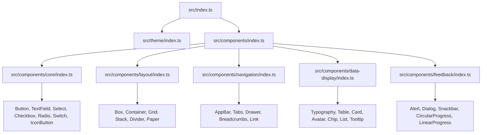

# Technical Specification

# 0. Agent Action Plan

## 0.1 Intent Clarification

### 0.1.1 Core Feature Objective

Based on the prompt, the Blitzy platform understands that the new feature requirement is to create a greenfield React component wrapper library built on top of Material UI (MUI) as the base design system. The project will be initialized from scratch in the repository `material-ui-component-lib-project-1`, which currently contains only a single `README.md` file.

The specific feature requirements are:

- **Create a React project** — Initialize a fully configured, enterprise-grade React project with TypeScript, Vite as the build tool, and proper package configuration for library distribution via npm
- **Build a wrapper component library using Material UI** — Develop themed wrapper components across five categories (Core, Layout, Navigation, Data Display, Feedback) that encapsulate MUI primitives with custom theming, consistent API surface, and full prop forwarding
- **Implement a Theme System** — Provide a `ThemeProvider` wrapper with design tokens covering color palette, typography scale, spacing, breakpoints, elevation/shadows, border radii, and dark/light mode switching
- **Distribute as a single npm package** — Configure ESM + CJS dual-format output with TypeScript `.d.ts` declarations, proper `exports` field, and peer dependency model for React, MUI, and Emotion

Implicit requirements detected:

- The project requires a three-tier layered architecture: Theme Layer → Component Layer → Infrastructure Layer (Build & Distribution)
- All runtime dependencies (React, MUI, Emotion) must be declared as peer dependencies to prevent version duplication
- Components must maintain WCAG 2.1 AA accessibility compliance via semantic HTML, ARIA attributes, keyboard navigation, and focus management — inheriting MUI's built-in accessibility behaviors
- Tree-shakeability must be preserved so consumers import only what they use, with a target of less than 15KB gzipped per component

### 0.1.2 Special Instructions and Constraints

**User-Specified Exclusions:**

- **No Storybook stories** — The user has explicitly stated that no Storybook documentation or story files should be created. This means Feature F-007 (Component Documentation via Storybook) from the tech spec is entirely excluded from this implementation
- **No test cases** — The user has explicitly stated that no test files should be created. This means Feature F-009 (Testing Infrastructure via Jest, React Testing Library, and axe-core) is entirely excluded from this implementation

**Architectural Requirements:**

- Follow the repository's established three-tier layered architecture (Theme → Component → Infrastructure)
- Use MUI's native composition pattern — wrap MUI primitives with prop forwarding rather than re-implementing components from scratch
- Use Emotion as the styling engine (MUI's default) — no alternative CSS-in-JS solutions
- All components must use the MUI v7 slot pattern for customization and CSS layers support
- Single `ThemeProvider` entry point pattern that mirrors MUI's own `ThemeProvider` mechanism
- Unidirectional dependency flow: Foundation → Theme → Components → Infrastructure

**Distribution Requirements:**

- Single npm package distribution model (monorepo multi-package is out of scope for this phase)
- Dual-format output (ESM + CJS) via Vite library mode
- TypeScript declaration files (`.d.ts`) generated by tsc
- SemVer 2.0.0 versioning policy

### 0.1.3 Technical Interpretation

These feature requirements translate to the following technical implementation strategy:

- To **create the React project**, we will initialize a new npm package with `package.json`, configure TypeScript via `tsconfig.json`, set up Vite in library mode via `vite.config.ts`, and create the standard project directory structure (`src/`, `dist/`)
- To **implement the Theme System**, we will create a `ThemeProvider` component wrapping MUI's `ThemeProvider`, define design tokens for colors, typography, spacing, breakpoints, shadows, and border radii, and support runtime dark/light mode switching via React Context
- To **build wrapper components**, we will create 30 components across 5 categories that wrap MUI primitives using composition over configuration, forward all MUI props via TypeScript generics, apply theme tokens via Emotion, and ensure accessibility by preserving MUI's native ARIA and keyboard behaviors
- To **enable library distribution**, we will configure Vite's library mode to produce ESM + CJS dual-format bundles, generate `.d.ts` type declarations, define the `exports` field in `package.json`, and declare React, MUI, and Emotion as peer dependencies
- To **exclude Storybook and testing**, we will omit all Storybook-related packages and configuration, omit all testing-related packages (Jest, RTL, axe-core), and not create any `*.stories.tsx` or `*.test.tsx` files

## 0.2 Repository Scope Discovery

### 0.2.1 Comprehensive File Analysis

The repository is a greenfield project. The current state contains a single file at the root:

| Path | Content | Action |
|------|---------|--------|
| `README.md` | `# material-ui-component-lib-project-1` | MODIFY — expand with project documentation |

Since this is a greenfield project, all files listed below will be created from scratch. The analysis below maps the complete file scope organized by architectural tier.

**Project Root — Configuration Files:**

| File | Purpose |
|------|---------|
| `package.json` | npm package manifest with scripts, peer/dev dependencies, `exports` field |
| `tsconfig.json` | TypeScript compiler configuration for the library |
| `tsconfig.build.json` | TypeScript configuration specifically for production declaration generation |
| `vite.config.ts` | Vite library-mode build configuration |
| `.gitignore` | Git ignore patterns for `node_modules/`, `dist/`, build artifacts |
| `.npmignore` | npm publish ignore patterns to exclude source files from distribution |
| `.eslintrc.cjs` | ESLint configuration for code quality |
| `.prettierrc` | Prettier configuration for code formatting |
| `LICENSE` | License file for npm package |

**Theme Layer — `src/theme/`:**

| File | Purpose |
|------|---------|
| `src/theme/index.ts` | Theme barrel export |
| `src/theme/ThemeProvider.tsx` | Custom ThemeProvider wrapping MUI ThemeProvider with design tokens |
| `src/theme/tokens/colors.ts` | Color palette tokens (primary, secondary, error, warning, info, success, neutral) |
| `src/theme/tokens/typography.ts` | Typography scale tokens (font families, sizes, weights, line heights) |
| `src/theme/tokens/spacing.ts` | Spacing scale tokens (4px base unit multipliers) |
| `src/theme/tokens/breakpoints.ts` | Responsive breakpoint tokens (xs, sm, md, lg, xl) |
| `src/theme/tokens/shadows.ts` | Shadow/elevation tokens mapped to MUI elevation levels |
| `src/theme/tokens/shape.ts` | Border radius tokens |
| `src/theme/tokens/index.ts` | Token barrel export aggregating all design token modules |
| `src/theme/createCustomTheme.ts` | Factory function composing all tokens into a MUI `createTheme()` call |
| `src/theme/types.ts` | TypeScript interfaces for theme configuration and custom token types |

**Component Layer — Core Components (`src/components/core/`):**

| File | Purpose |
|------|---------|
| `src/components/core/Button/Button.tsx` | Button wrapper with themed variants (contained, outlined, text) |
| `src/components/core/Button/index.ts` | Button barrel export |
| `src/components/core/TextField/TextField.tsx` | TextField wrapper with themed input styling |
| `src/components/core/TextField/index.ts` | TextField barrel export |
| `src/components/core/Select/Select.tsx` | Select wrapper with dropdown theming |
| `src/components/core/Select/index.ts` | Select barrel export |
| `src/components/core/Checkbox/Checkbox.tsx` | Checkbox wrapper with themed states |
| `src/components/core/Checkbox/index.ts` | Checkbox barrel export |
| `src/components/core/Radio/Radio.tsx` | Radio button wrapper with themed group support |
| `src/components/core/Radio/index.ts` | Radio barrel export |
| `src/components/core/Switch/Switch.tsx` | Toggle switch wrapper with themed on/off states |
| `src/components/core/Switch/index.ts` | Switch barrel export |
| `src/components/core/IconButton/IconButton.tsx` | Icon button wrapper with themed sizing |
| `src/components/core/IconButton/index.ts` | IconButton barrel export |
| `src/components/core/index.ts` | Core components barrel export |

**Component Layer — Layout Components (`src/components/layout/`):**

| File | Purpose |
|------|---------|
| `src/components/layout/Box/Box.tsx` | Box wrapper for theme-aware container/spacing |
| `src/components/layout/Box/index.ts` | Box barrel export |
| `src/components/layout/Container/Container.tsx` | Container wrapper with responsive max-width |
| `src/components/layout/Container/index.ts` | Container barrel export |
| `src/components/layout/Grid/Grid.tsx` | Grid wrapper for responsive 12-column layout |
| `src/components/layout/Grid/index.ts` | Grid barrel export |
| `src/components/layout/Stack/Stack.tsx` | Stack wrapper for flex-direction stacking |
| `src/components/layout/Stack/index.ts` | Stack barrel export |
| `src/components/layout/Divider/Divider.tsx` | Divider wrapper with themed color/spacing |
| `src/components/layout/Divider/index.ts` | Divider barrel export |
| `src/components/layout/Paper/Paper.tsx` | Paper wrapper with themed elevation and surface color |
| `src/components/layout/Paper/index.ts` | Paper barrel export |
| `src/components/layout/index.ts` | Layout components barrel export |

**Component Layer — Navigation Components (`src/components/navigation/`):**

| File | Purpose |
|------|---------|
| `src/components/navigation/AppBar/AppBar.tsx` | AppBar wrapper with themed top navigation bar |
| `src/components/navigation/AppBar/index.ts` | AppBar barrel export |
| `src/components/navigation/Tabs/Tabs.tsx` | Tabs wrapper with themed tab panels and indicators |
| `src/components/navigation/Tabs/index.ts` | Tabs barrel export |
| `src/components/navigation/Drawer/Drawer.tsx` | Drawer wrapper for themed side navigation |
| `src/components/navigation/Drawer/index.ts` | Drawer barrel export |
| `src/components/navigation/Breadcrumbs/Breadcrumbs.tsx` | Breadcrumbs wrapper with themed separators |
| `src/components/navigation/Breadcrumbs/index.ts` | Breadcrumbs barrel export |
| `src/components/navigation/Link/Link.tsx` | Link wrapper with themed anchor styles |
| `src/components/navigation/Link/index.ts` | Link barrel export |
| `src/components/navigation/index.ts` | Navigation components barrel export |

**Component Layer — Data Display Components (`src/components/data-display/`):**

| File | Purpose |
|------|---------|
| `src/components/data-display/Typography/Typography.tsx` | Typography wrapper with themed text styles |
| `src/components/data-display/Typography/index.ts` | Typography barrel export |
| `src/components/data-display/Table/Table.tsx` | Table wrapper with themed headers, rows, and cells |
| `src/components/data-display/Table/index.ts` | Table barrel export |
| `src/components/data-display/Card/Card.tsx` | Card wrapper with themed content containers |
| `src/components/data-display/Card/index.ts` | Card barrel export |
| `src/components/data-display/Avatar/Avatar.tsx` | Avatar wrapper with themed sizing and shapes |
| `src/components/data-display/Avatar/index.ts` | Avatar barrel export |
| `src/components/data-display/Chip/Chip.tsx` | Chip wrapper with themed labels and actions |
| `src/components/data-display/Chip/index.ts` | Chip barrel export |
| `src/components/data-display/List/List.tsx` | List wrapper with themed item layouts |
| `src/components/data-display/List/index.ts` | List barrel export |
| `src/components/data-display/Tooltip/Tooltip.tsx` | Tooltip wrapper with themed popup positioning |
| `src/components/data-display/Tooltip/index.ts` | Tooltip barrel export |
| `src/components/data-display/index.ts` | Data display components barrel export |

**Component Layer — Feedback Components (`src/components/feedback/`):**

| File | Purpose |
|------|---------|
| `src/components/feedback/Alert/Alert.tsx` | Alert wrapper with themed severity variants |
| `src/components/feedback/Alert/index.ts` | Alert barrel export |
| `src/components/feedback/Dialog/Dialog.tsx` | Dialog wrapper with themed modal behavior |
| `src/components/feedback/Dialog/index.ts` | Dialog barrel export |
| `src/components/feedback/Snackbar/Snackbar.tsx` | Snackbar wrapper with themed notification positioning |
| `src/components/feedback/Snackbar/index.ts` | Snackbar barrel export |
| `src/components/feedback/CircularProgress/CircularProgress.tsx` | CircularProgress wrapper with themed colors |
| `src/components/feedback/CircularProgress/index.ts` | CircularProgress barrel export |
| `src/components/feedback/LinearProgress/LinearProgress.tsx` | LinearProgress wrapper with themed track/bar colors |
| `src/components/feedback/LinearProgress/index.ts` | LinearProgress barrel export |
| `src/components/feedback/index.ts` | Feedback components barrel export |

**Infrastructure Layer — Library Entry and Build:**

| File | Purpose |
|------|---------|
| `src/index.ts` | Library root barrel export aggregating all components and theme |
| `src/components/index.ts` | Components barrel export aggregating all categories |
| `src/types/index.ts` | Shared TypeScript utility types and common interfaces |

### 0.2.2 Web Search Research Conducted

The following research was performed to validate implementation approach and dependency versions:

- **MUI v7 component library patterns** — Confirmed MUI v7.x supports React 19, CSS layers, slot-based customization, and Emotion-based theming
- **TypeScript latest stable version** — Confirmed TypeScript 5.9.3 is the latest stable release on npm (published August 2025), satisfying the project's `≥5.4` requirement
- **Vite 7 library mode compatibility** — Confirmed Vite 7.3.1 requires Node.js 20.19+ (our 20.20.0 satisfies this constraint) and supports Rollup-based library builds with ESM + CJS dual output
- **React 19 peer dependency model** — Confirmed React 19.x is the current stable major, fully compatible with MUI v7
- **Emotion compatibility** — Confirmed @emotion/react 11.14.0 and @emotion/styled 11.14.1 are the latest stable versions, compatible with MUI v7 theming

### 0.2.3 New File Requirements

**New Source Files (Total: 95 files):**

- Theme System: 11 files under `src/theme/`
- Core Components: 7 components × 2 files (component + barrel) + 1 category barrel = 15 files under `src/components/core/`
- Layout Components: 6 components × 2 files + 1 category barrel = 13 files under `src/components/layout/`
- Navigation Components: 5 components × 2 files + 1 category barrel = 11 files under `src/components/navigation/`
- Data Display Components: 7 components × 2 files + 1 category barrel = 15 files under `src/components/data-display/`
- Feedback Components: 5 components × 2 files + 1 category barrel = 11 files under `src/components/feedback/`
- Infrastructure: 3 files (`src/index.ts`, `src/components/index.ts`, `src/types/index.ts`)
- Root Configuration: 9 files (`package.json`, `tsconfig.json`, `tsconfig.build.json`, `vite.config.ts`, `.gitignore`, `.npmignore`, `.eslintrc.cjs`, `.prettierrc`, `LICENSE`)

**Files Modified:**

- `README.md` — Expand with project overview, installation instructions, usage examples, component catalog, and contribution guidelines

**Explicitly Excluded Files:**

- No `*.stories.tsx` files (per user instruction: no Storybook)
- No `*.test.tsx` or `*.spec.tsx` files (per user instruction: no tests)
- No `jest.config.*` files
- No `.storybook/` directory
- No `tests/` or `__tests__/` directories

## 0.3 Dependency Inventory

### 0.3.1 Private and Public Packages

Since this is a greenfield project, all dependencies are new. The following table catalogs every package required for the component library, organized by dependency type.

**Peer Dependencies (installed by consumers, not bundled):**

| Registry | Package | Version | Purpose |
|----------|---------|---------|---------|
| npm | `react` | ^19.0.0 | React core runtime — UI rendering engine |
| npm | `react-dom` | ^19.0.0 | React DOM renderer — browser rendering target |
| npm | `@mui/material` | ^7.0.0 | Material UI component primitives — base component library |
| npm | `@emotion/react` | ^11.14.0 | Emotion CSS-in-JS runtime — MUI's default styling engine |
| npm | `@emotion/styled` | ^11.14.0 | Emotion styled components API — styled component creation |

**Dev Dependencies (used during development and build only):**

| Registry | Package | Version | Purpose |
|----------|---------|---------|---------|
| npm | `typescript` | ~5.9.3 | TypeScript compiler — type checking and `.d.ts` declaration generation |
| npm | `vite` | ^7.3.1 | Build tool — library-mode bundling with Rollup internals |
| npm | `@vitejs/plugin-react` | ^4.5.2 | Vite React plugin — JSX transform and React Fast Refresh |
| npm | `@types/react` | ^19.0.0 | React TypeScript type definitions |
| npm | `@types/react-dom` | ^19.0.0 | React DOM TypeScript type definitions |
| npm | `@mui/types` | ^7.0.0 | MUI shared TypeScript utility types |
| npm | `eslint` | ^9.0.0 | Code linter — static analysis for code quality |
| npm | `@eslint/js` | ^9.0.0 | ESLint JavaScript rules preset |
| npm | `typescript-eslint` | ^8.0.0 | ESLint TypeScript integration plugin |
| npm | `prettier` | ^3.5.0 | Code formatter — consistent code style enforcement |
| npm | `eslint-config-prettier` | ^10.0.0 | Disables ESLint rules that conflict with Prettier |

**Explicitly Excluded Packages (per user instruction):**

| Package | Reason for Exclusion |
|---------|---------------------|
| `@storybook/react-vite` | User instruction: no Storybook stories |
| `@storybook/addon-essentials` | User instruction: no Storybook stories |
| `@storybook/blocks` | User instruction: no Storybook stories |
| `jest` | User instruction: no test cases |
| `@testing-library/react` | User instruction: no test cases |
| `@testing-library/jest-dom` | User instruction: no test cases |
| `jest-axe` | User instruction: no test cases |
| `axe-core` | User instruction: no test cases |
| `jest-environment-jsdom` | User instruction: no test cases |

### 0.3.2 Dependency Updates

Since this is a greenfield project, there are no existing dependencies to update. All dependencies listed above will be installed fresh.

**Import Structure:**

The library establishes a clean import hierarchy following the three-tier architecture:

- Theme imports: `import { ThemeProvider, createCustomTheme } from './theme'`
- Component imports: `import { Button, TextField } from './components/core'`
- Category barrels aggregate per category: `import * from './components/layout'`
- Root barrel aggregates everything: `import { Button, ThemeProvider } from 'material-ui-component-lib-project-1'`

**External Reference Configuration:**

- `package.json` — `exports` field mapping:
  - `.` → `src/index.ts` (main entry)
  - `./theme` → `src/theme/index.ts` (direct theme access)
  - `./components/*` → `src/components/*/index.ts` (per-category access)
- `package.json` — `peerDependencies` field declaring React, MUI, and Emotion
- `tsconfig.json` — `compilerOptions.jsx` set to `react-jsx` for automatic JSX runtime
- `vite.config.ts` — `build.lib` configuration for library mode, `build.rollupOptions.external` listing all peer dependencies

## 0.4 Integration Analysis

### 0.4.1 Existing Code Touchpoints

Since this is a greenfield project, there is only one existing file to modify:

**Direct Modifications Required:**

| File | Modification | Details |
|------|-------------|---------|
| `README.md` | Expand content | Replace single heading with full project documentation including installation, quick start, component catalog, theming guide, and API reference |

### 0.4.2 Internal Integration Points

The following integration points define how the library's architectural layers connect to each other within the codebase:

**Theme → Component Integration:**

Every wrapper component integrates with the theme system via MUI's `useTheme()` hook. The `ThemeProvider` at the top of the component tree distributes design tokens through React Context to all child components.

- `src/theme/ThemeProvider.tsx` → provides the theme context consumed by every component
- `src/theme/createCustomTheme.ts` → generates the MUI theme object that `ThemeProvider` distributes
- All `src/components/**/*.tsx` files consume theme tokens via MUI's `useTheme()` or the `sx` prop

**Component → Infrastructure Integration:**

The library entry point (`src/index.ts`) aggregates all component and theme exports into a single public API surface. The build system (Vite) uses this entry point to produce distributable bundles.

- `src/index.ts` → imports from `src/components/index.ts` and `src/theme/index.ts`
- `src/components/index.ts` → imports from each category barrel (`core/index.ts`, `layout/index.ts`, etc.)
- `vite.config.ts` → references `src/index.ts` as the library entry for build output

**Barrel Export Chain (dependency flow):**



### 0.4.3 Consumer Integration Model

The library is designed for consumption by downstream React applications. The consumer integration pattern follows a predictable model:

**Installation:**
Consumers install the library alongside its peer dependencies:

```bash
npm install material-ui-component-lib-project-1 @mui/material @emotion/react @emotion/styled react react-dom
```

**Usage:**
Consumers wrap their application with the library's `ThemeProvider` and use wrapper components directly:

```tsx
import { ThemeProvider, Button, Card } from 'material-ui-component-lib-project-1';
```

**Build Output Integration:**
The library's `package.json` `exports` field enables multiple consumption patterns:

| Entry Point | Format | Consumer Use Case |
|-------------|--------|-------------------|
| `./dist/index.es.js` | ESM | Modern bundlers (Vite, Webpack 5, Rollup) |
| `./dist/index.cjs.js` | CJS | Legacy Node.js require() |
| `./dist/index.d.ts` | TypeScript declarations | IDE autocompletion and type checking |

### 0.4.4 Peer Dependency Wiring

The library declares all runtime dependencies as peer dependencies, meaning they are not bundled into the output. This is critical for preventing version duplication when consumers already have React, MUI, and Emotion installed.

**Vite External Configuration:**
The `vite.config.ts` must externalize all peer dependencies from the build:

- `react` and `react-dom` — excluded from bundle
- `@mui/material` and all `@mui/*` sub-packages — excluded from bundle
- `@emotion/react` and `@emotion/styled` — excluded from bundle

This ensures the library resolves to the consumer's installed versions at runtime, preventing "multiple React instances" and "invalid hook call" errors.

## 0.5 Design System Compliance

### 0.5.1 System Identification

- **Library:** Material UI (MUI), **Version:** ^7.0.0 (latest stable: 7.3.8), **Status:** To be added (greenfield project)
- **Package:** `@mui/material` on npm registry (`registry.npmjs.org`)
- **Source:** Official documentation at `https://mui.com/material-ui/` — API references, theming guide, and migration guide for v7 reviewed
- **Styling Engine:** Emotion (`@emotion/react` ^11.14.0, `@emotion/styled` ^11.14.0) — MUI's default CSS-in-JS runtime
- **Theme Mechanism:** `createTheme()` + `ThemeProvider` with CSS theme variables support and `cssVariables` option for native CSS custom properties

### 0.5.2 Component Mapping

The following table maps each wrapper component to its corresponding MUI library component, including the exact import path, key props, and notes on wrapper behavior.

**Core Components:**

| UI Element | MUI Component | Import Path | Key Props / Variants | Notes |
|-----------|---------------|-------------|---------------------|-------|
| Button | Button | @mui/material/Button | variant: contained, outlined, text; color; size; disabled; startIcon, endIcon | Extends with custom theme color tokens |
| TextField | TextField | @mui/material/TextField | variant: outlined, filled, standard; label; error; helperText; size | Wraps complete form control (label + input + helper) |
| Select | Select | @mui/material/Select | value; onChange; multiple; displayEmpty; variant | Paired with MenuItem for option rendering |
| Checkbox | Checkbox | @mui/material/Checkbox | checked; onChange; color; disabled; indeterminate | Wraps with FormControlLabel for label support |
| Radio | RadioGroup + Radio | @mui/material/RadioGroup, @mui/material/Radio | value; onChange; row | RadioGroup provides context for Radio children |
| Switch | Switch | @mui/material/Switch | checked; onChange; color; size; disabled | Wraps with FormControlLabel for label support |
| IconButton | IconButton | @mui/material/IconButton | color; size; edge; disabled; aria-label | Requires accessible aria-label prop |

**Layout Components:**

| UI Element | MUI Component | Import Path | Key Props / Variants | Notes |
|-----------|---------------|-------------|---------------------|-------|
| Box | Box | @mui/material/Box | sx; component; display; flexDirection | Theme-aware container using sx prop system |
| Container | Container | @mui/material/Container | maxWidth: xs, sm, md, lg, xl, false; fixed; disableGutters | Responsive max-width container |
| Grid | Grid | @mui/material/Grid | container; size; offset; spacing; columns | MUI v7 uses Grid (renamed from Grid2) |
| Stack | Stack | @mui/material/Stack | direction; spacing; divider; useFlexGap | Flex-direction shorthand layout |
| Divider | Divider | @mui/material/Divider | orientation; variant; flexItem; textAlign | Themed horizontal/vertical separator |
| Paper | Paper | @mui/material/Paper | elevation: 0-24; variant: elevation, outlined; square | Surface container with elevation shadow |

**Navigation Components:**

| UI Element | MUI Component | Import Path | Key Props / Variants | Notes |
|-----------|---------------|-------------|---------------------|-------|
| AppBar | AppBar | @mui/material/AppBar | position: fixed, absolute, sticky, static, relative; color | Themed top navigation bar with Toolbar child |
| Tabs | Tabs + Tab | @mui/material/Tabs, @mui/material/Tab | value; onChange; variant: standard, scrollable, fullWidth; orientation | Tab panels managed externally |
| Drawer | Drawer | @mui/material/Drawer | anchor: left, right, top, bottom; variant: permanent, persistent, temporary; open | Side navigation container |
| Breadcrumbs | Breadcrumbs | @mui/material/Breadcrumbs | separator; maxItems; itemsBeforeCollapse; itemsAfterCollapse | Themed navigation hierarchy with Link children |
| Link | Link | @mui/material/Link | href; underline: always, hover, none; color; variant | Themed anchor with typography integration |

**Data Display Components:**

| UI Element | MUI Component | Import Path | Key Props / Variants | Notes |
|-----------|---------------|-------------|---------------------|-------|
| Typography | Typography | @mui/material/Typography | variant: h1-h6, subtitle1-2, body1-2, caption, overline; component; color; gutterBottom | Core text rendering with theme typography scale |
| Table | Table + TableHead + TableBody + TableRow + TableCell | @mui/material/Table* | size; padding; stickyHeader; align | Composed from multiple sub-components |
| Card | Card + CardHeader + CardContent + CardActions + CardMedia | @mui/material/Card* | variant: elevation, outlined; raised | Composed content container |
| Avatar | Avatar | @mui/material/Avatar | src; alt; variant: circular, rounded, square; sx (for sizing) | Themed image/letter/icon avatar |
| Chip | Chip | @mui/material/Chip | label; variant: filled, outlined; color; size; onDelete; icon; avatar | Themed compact element for tags/actions |
| List | List + ListItem + ListItemText + ListItemIcon + ListItemButton | @mui/material/List* | dense; disablePadding; subheader | Composed list container |
| Tooltip | Tooltip | @mui/material/Tooltip | title; placement; arrow; enterDelay; leaveDelay | Themed informational popup |

**Feedback Components:**

| UI Element | MUI Component | Import Path | Key Props / Variants | Notes |
|-----------|---------------|-------------|---------------------|-------|
| Alert | Alert | @mui/material/Alert | severity: error, warning, info, success; variant: standard, filled, outlined; action | Themed notification banner |
| Dialog | Dialog + DialogTitle + DialogContent + DialogActions | @mui/material/Dialog* | open; onClose; maxWidth; fullWidth; fullScreen | Composed modal dialog |
| Snackbar | Snackbar | @mui/material/Snackbar | open; autoHideDuration; onClose; anchorOrigin; message | Themed toast notification |
| CircularProgress | CircularProgress | @mui/material/CircularProgress | variant: determinate, indeterminate; value; size; color | Themed spinner indicator |
| LinearProgress | LinearProgress | @mui/material/LinearProgress | variant: determinate, indeterminate, buffer, query; value; color | Themed progress bar |

### 0.5.3 Design Token Catalog

The library's theme system maps to MUI's default theme tokens with custom extensions. The following tokens are defined within the theme layer.

**Color Tokens (via `theme.palette`):**

| Token Category | MUI Theme Path | Default Value | Purpose |
|---------------|---------------|---------------|---------|
| Primary | `palette.primary.main` | `#1976d2` (blue[700]) | Primary brand color for interactive elements |
| Primary Light | `palette.primary.light` | Calculated via `tonalOffset` | Lighter variant for hover/selected states |
| Primary Dark | `palette.primary.dark` | Calculated via `tonalOffset` | Darker variant for pressed states |
| Secondary | `palette.secondary.main` | `#9c27b0` (purple[500]) | Secondary accent color |
| Error | `palette.error.main` | `#d32f2f` (red[700]) | Error and destructive action color |
| Warning | `palette.warning.main` | `#ed6c02` (orange[800]) | Warning notification color |
| Info | `palette.info.main` | `#0288d1` (lightBlue[700]) | Informational element color |
| Success | `palette.success.main` | `#2e7d32` (green[800]) | Success confirmation color |
| Background Default | `palette.background.default` | `#fff` | Page background color |
| Background Paper | `palette.background.paper` | `#fff` | Surface/card background color |
| Text Primary | `palette.text.primary` | `rgba(0,0,0,0.87)` | Primary body text color |
| Text Secondary | `palette.text.secondary` | `rgba(0,0,0,0.6)` | Secondary/muted text color |

**Typography Tokens (via `theme.typography`):**

| Token | Font Family | Size | Weight | Line Height |
|-------|------------|------|--------|-------------|
| h1 | Roboto, sans-serif | 6rem (96px) | 300 | 1.167 |
| h2 | Roboto, sans-serif | 3.75rem (60px) | 300 | 1.2 |
| h3 | Roboto, sans-serif | 3rem (48px) | 400 | 1.167 |
| h4 | Roboto, sans-serif | 2.125rem (34px) | 400 | 1.235 |
| h5 | Roboto, sans-serif | 1.5rem (24px) | 400 | 1.334 |
| h6 | Roboto, sans-serif | 1.25rem (20px) | 500 | 1.6 |
| body1 | Roboto, sans-serif | 1rem (16px) | 400 | 1.5 |
| body2 | Roboto, sans-serif | 0.875rem (14px) | 400 | 1.43 |
| caption | Roboto, sans-serif | 0.75rem (12px) | 400 | 1.66 |
| button | Roboto, sans-serif | 0.875rem (14px) | 500 | 1.75 |

**Spacing Tokens (via `theme.spacing`):**

| Factor | Value | Common Usage |
|--------|-------|-------------|
| 0 | 0px | No spacing |
| 0.5 | 4px | Minimal gap |
| 1 | 8px | Base unit (default spacing factor) |
| 2 | 16px | Standard component padding |
| 3 | 24px | Section padding |
| 4 | 32px | Large section gap |
| 5 | 40px | Container margin |
| 6 | 48px | Major section separation |

**Shape Tokens (via `theme.shape`):**

| Token | Default Value | Purpose |
|-------|--------------|---------|
| `borderRadius` | `4px` | Default border radius for all components |

**Breakpoint Tokens (via `theme.breakpoints`):**

| Breakpoint | Min Width | Target Devices |
|-----------|-----------|----------------|
| xs | 0px | Mobile portrait |
| sm | 600px | Mobile landscape / small tablet |
| md | 900px | Tablet |
| lg | 1200px | Desktop |
| xl | 1536px | Large desktop |

**Shadow/Elevation Tokens (via `theme.shadows`):**

MUI provides 25 shadow levels (0-24) via `theme.shadows[n]`, where `shadows[0]` is `none` and `shadows[24]` is the maximum elevation. The wrapper components inherit these directly through the `elevation` prop on `Paper`-based components.

### 0.5.4 Gaps Inventory

Since the wrapper library is built entirely on top of MUI's component primitives, there are no design system gaps for the 30 identified components. Every wrapper component maps directly to a corresponding MUI component.

| Gap Category | Count | Details |
|-------------|-------|---------|
| Components without MUI equivalent | 0 | All 30 wrapper components have direct MUI counterparts |
| Token values without system mapping | 0 | All tokens use MUI's default theme values as baseline |
| Accessibility gaps | 0 | MUI provides built-in ARIA attributes, keyboard navigation, and focus management |

**Potential Future Gaps (Out of Scope):**
- Custom composite components not present in MUI (e.g., data grids, date pickers) would require MUI X packages
- Complex animated transitions beyond MUI's built-in `Grow`, `Fade`, `Slide`, `Collapse` transitions

### 0.5.5 Compliance Summary

The wrapper component library achieves full design system compliance with MUI v7. All 30 components across 5 categories map directly to MUI primitives — no raw HTML elements are used where MUI equivalents exist. The theme system leverages MUI's `createTheme()` API with CSS theme variables support, providing comprehensive token coverage for colors (12 semantic tokens), typography (10 variants), spacing (8 factors), breakpoints (5 sizes), shape (border radius), and 25 elevation levels. Zero design system gaps exist for the defined component scope. The only new dependency to be added is `@mui/material` ^7.0.0 along with its required peer dependencies (`@emotion/react`, `@emotion/styled`), all to be declared as peer dependencies of the wrapper library itself.

**Compliance Rules for Downstream Code Generation:**

- **Zero hardcoded CSS values** — every color, spacing, font, shadow, and radius must resolve to a MUI theme token via `theme.palette.*`, `theme.spacing()`, `theme.typography.*`, `theme.shadows[]`, or `theme.shape.*`
- **MUI components over raw HTML** — never use raw `<button>`, `<input>`, `<select>`, `<table>`, or heading elements; always use their MUI equivalents (Button, TextField, Select, Table, Typography)
- **Layout via MUI primitives** — all spacing and alignment through Box, Container, Grid, Stack; no custom CSS flex/grid on raw divs
- **sx prop for one-off styles** — use MUI's `sx` prop system which respects theme tokens, not inline `style` attributes

## 0.6 Technical Implementation

### 0.6.1 File-by-File Execution Plan

Every file listed below MUST be created or modified to deliver the complete wrapper component library. Files are grouped by architectural tier and execution priority.

**Group 1 — Project Root Configuration (9 files):**

| Action | File Path | Purpose |
|--------|----------|---------|
| CREATE | `package.json` | Project manifest with name, version 0.1.0, peer/dev dependencies, scripts (build, lint, format, clean), exports field mapping ESM/CJS/types |
| CREATE | `tsconfig.json` | TypeScript configuration: strict mode, jsx: react-jsx, target: ES2020, module: ESNext, declaration: true, declarationDir: dist/types |
| CREATE | `tsconfig.build.json` | Build-specific TypeScript config extending base, excluding dev files, include src/**/* only |
| CREATE | `vite.config.ts` | Vite 7 library mode config: React plugin, lib entry src/index.ts, ESM+CJS output, external peer deps, CSS inject false |
| CREATE | `.eslintrc.cjs` | ESLint flat config with typescript-eslint, React rules, import ordering |
| CREATE | `.prettierrc` | Prettier config: singleQuote, trailingComma all, semi true, printWidth 100, tabWidth 2 |
| CREATE | `.gitignore` | Git ignore: node_modules/, dist/, *.tsbuildinfo, .eslintcache |
| CREATE | `.npmignore` | npm publish ignore: src/, *.config.*, tsconfig*, .eslintrc*, .prettierrc |
| MODIFY | `README.md` | Replace placeholder with project documentation: installation, usage with ThemeProvider, component API overview |

**Group 2 — Theme Layer (11 files):**

| Action | File Path | Purpose |
|--------|----------|---------|
| CREATE | `src/theme/index.ts` | Theme barrel export: re-exports createCustomTheme, ThemeProvider, tokens, types |
| CREATE | `src/theme/ThemeProvider.tsx` | Wrapper ThemeProvider component: wraps MUI ThemeProvider + CssBaseline, accepts theme prop with default |
| CREATE | `src/theme/createTheme.ts` | Factory function: wraps MUI createTheme with library defaults, accepts partial overrides for palette, typography, spacing, shape |
| CREATE | `src/theme/tokens/index.ts` | Token barrel export: re-exports all token modules |
| CREATE | `src/theme/tokens/colors.ts` | Color token definitions: palette object with primary, secondary, error, warning, info, success, grey, text, background, divider |
| CREATE | `src/theme/tokens/typography.ts` | Typography token definitions: fontFamily, fontSize scale, fontWeight scale, lineHeight scale, variant mappings |
| CREATE | `src/theme/tokens/spacing.ts` | Spacing token definitions: base unit (8px), spacing scale factor function |
| CREATE | `src/theme/tokens/shadows.ts` | Shadow token definitions: 25-level elevation array, custom shadow presets |
| CREATE | `src/theme/tokens/breakpoints.ts` | Breakpoint token definitions: xs/sm/md/lg/xl values with step configurations |
| CREATE | `src/theme/tokens/shape.ts` | Shape token definitions: borderRadius values for sm/md/lg variants |
| CREATE | `src/theme/types.ts` | Theme TypeScript types: CustomTheme interface, ThemeProviderProps, token type exports, module augmentation declarations |

**Group 3 — Core Components (15 files: 7 components × 2 files + barrel):**

| Action | File Path | Purpose |
|--------|----------|---------|
| CREATE | `src/components/core/index.ts` | Core barrel export |
| CREATE | `src/components/core/Button/Button.tsx` | Button wrapper: extends MUI Button, adds custom variant mapping, forwards all MUI props via generics |
| CREATE | `src/components/core/Button/index.ts` | Button module export |
| CREATE | `src/components/core/TextField/TextField.tsx` | TextField wrapper: extends MUI TextField, standardizes variant/size defaults |
| CREATE | `src/components/core/TextField/index.ts` | TextField module export |
| CREATE | `src/components/core/Select/Select.tsx` | Select wrapper: extends MUI Select + MenuItem, provides typed option pattern |
| CREATE | `src/components/core/Select/index.ts` | Select module export |
| CREATE | `src/components/core/Checkbox/Checkbox.tsx` | Checkbox wrapper: extends MUI Checkbox + FormControlLabel integration |
| CREATE | `src/components/core/Checkbox/index.ts` | Checkbox module export |
| CREATE | `src/components/core/Radio/Radio.tsx` | Radio wrapper: extends MUI RadioGroup + Radio + FormControlLabel |
| CREATE | `src/components/core/Radio/index.ts` | Radio module export |
| CREATE | `src/components/core/Switch/Switch.tsx` | Switch wrapper: extends MUI Switch + FormControlLabel integration |
| CREATE | `src/components/core/Switch/index.ts` | Switch module export |
| CREATE | `src/components/core/IconButton/IconButton.tsx` | IconButton wrapper: extends MUI IconButton, enforces aria-label requirement |
| CREATE | `src/components/core/IconButton/index.ts` | IconButton module export |

**Group 4 — Layout Components (13 files: 6 components × 2 files + barrel):**

| Action | File Path | Purpose |
|--------|----------|---------|
| CREATE | `src/components/layout/index.ts` | Layout barrel export |
| CREATE | `src/components/layout/Box/Box.tsx` | Box wrapper: extends MUI Box, theme-aware sx prop container |
| CREATE | `src/components/layout/Box/index.ts` | Box module export |
| CREATE | `src/components/layout/Container/Container.tsx` | Container wrapper: extends MUI Container, responsive max-width |
| CREATE | `src/components/layout/Container/index.ts` | Container module export |
| CREATE | `src/components/layout/Grid/Grid.tsx` | Grid wrapper: extends MUI Grid (v7 renamed from Grid2), responsive layout |
| CREATE | `src/components/layout/Grid/index.ts` | Grid module export |
| CREATE | `src/components/layout/Stack/Stack.tsx` | Stack wrapper: extends MUI Stack, directional flex layout |
| CREATE | `src/components/layout/Stack/index.ts` | Stack module export |
| CREATE | `src/components/layout/Divider/Divider.tsx` | Divider wrapper: extends MUI Divider, themed separator |
| CREATE | `src/components/layout/Divider/index.ts` | Divider module export |
| CREATE | `src/components/layout/Paper/Paper.tsx` | Paper wrapper: extends MUI Paper, elevation surface |
| CREATE | `src/components/layout/Paper/index.ts` | Paper module export |

**Group 5 — Navigation Components (11 files: 5 components × 2 files + barrel):**

| Action | File Path | Purpose |
|--------|----------|---------|
| CREATE | `src/components/navigation/index.ts` | Navigation barrel export |
| CREATE | `src/components/navigation/AppBar/AppBar.tsx` | AppBar wrapper: extends MUI AppBar + Toolbar, themed top nav |
| CREATE | `src/components/navigation/AppBar/index.ts` | AppBar module export |
| CREATE | `src/components/navigation/Tabs/Tabs.tsx` | Tabs wrapper: extends MUI Tabs + Tab, controlled tab navigation |
| CREATE | `src/components/navigation/Tabs/index.ts` | Tabs module export |
| CREATE | `src/components/navigation/Drawer/Drawer.tsx` | Drawer wrapper: extends MUI Drawer, side panel navigation |
| CREATE | `src/components/navigation/Drawer/index.ts` | Drawer module export |
| CREATE | `src/components/navigation/Breadcrumbs/Breadcrumbs.tsx` | Breadcrumbs wrapper: extends MUI Breadcrumbs + Link hierarchy |
| CREATE | `src/components/navigation/Breadcrumbs/index.ts` | Breadcrumbs module export |
| CREATE | `src/components/navigation/Link/Link.tsx` | Link wrapper: extends MUI Link, themed anchor element |
| CREATE | `src/components/navigation/Link/index.ts` | Link module export |

**Group 6 — Data Display Components (15 files: 7 components × 2 files + barrel):**

| Action | File Path | Purpose |
|--------|----------|---------|
| CREATE | `src/components/data-display/index.ts` | Data display barrel export |
| CREATE | `src/components/data-display/Typography/Typography.tsx` | Typography wrapper: extends MUI Typography, variant rendering |
| CREATE | `src/components/data-display/Typography/index.ts` | Typography module export |
| CREATE | `src/components/data-display/Table/Table.tsx` | Table wrapper: extends MUI Table + TableHead + TableBody + TableRow + TableCell, typed columns |
| CREATE | `src/components/data-display/Table/index.ts` | Table module export |
| CREATE | `src/components/data-display/Card/Card.tsx` | Card wrapper: extends MUI Card + CardHeader + CardContent + CardActions + CardMedia |
| CREATE | `src/components/data-display/Card/index.ts` | Card module export |
| CREATE | `src/components/data-display/Avatar/Avatar.tsx` | Avatar wrapper: extends MUI Avatar, image/letter/icon avatar |
| CREATE | `src/components/data-display/Avatar/index.ts` | Avatar module export |
| CREATE | `src/components/data-display/Chip/Chip.tsx` | Chip wrapper: extends MUI Chip, tag/action element |
| CREATE | `src/components/data-display/Chip/index.ts` | Chip module export |
| CREATE | `src/components/data-display/List/List.tsx` | List wrapper: extends MUI List + ListItem + ListItemText + ListItemIcon + ListItemButton |
| CREATE | `src/components/data-display/List/index.ts` | List module export |
| CREATE | `src/components/data-display/Tooltip/Tooltip.tsx` | Tooltip wrapper: extends MUI Tooltip, informational popup |
| CREATE | `src/components/data-display/Tooltip/index.ts` | Tooltip module export |

**Group 7 — Feedback Components (11 files: 5 components × 2 files + barrel):**

| Action | File Path | Purpose |
|--------|----------|---------|
| CREATE | `src/components/feedback/index.ts` | Feedback barrel export |
| CREATE | `src/components/feedback/Alert/Alert.tsx` | Alert wrapper: extends MUI Alert, severity-based notification |
| CREATE | `src/components/feedback/Alert/index.ts` | Alert module export |
| CREATE | `src/components/feedback/Dialog/Dialog.tsx` | Dialog wrapper: extends MUI Dialog + DialogTitle + DialogContent + DialogActions |
| CREATE | `src/components/feedback/Dialog/index.ts` | Dialog module export |
| CREATE | `src/components/feedback/Snackbar/Snackbar.tsx` | Snackbar wrapper: extends MUI Snackbar, toast notification |
| CREATE | `src/components/feedback/Snackbar/index.ts` | Snackbar module export |
| CREATE | `src/components/feedback/CircularProgress/CircularProgress.tsx` | CircularProgress wrapper: extends MUI CircularProgress, spinner |
| CREATE | `src/components/feedback/CircularProgress/index.ts` | CircularProgress module export |
| CREATE | `src/components/feedback/LinearProgress/LinearProgress.tsx` | LinearProgress wrapper: extends MUI LinearProgress, progress bar |
| CREATE | `src/components/feedback/LinearProgress/index.ts` | LinearProgress module export |

**Group 8 — Library Infrastructure (3 files):**

| Action | File Path | Purpose |
|--------|----------|---------|
| CREATE | `src/index.ts` | Root barrel export: re-exports all components + theme + types for public API surface |
| CREATE | `src/components/index.ts` | Components barrel export: re-exports all 5 category barrels |
| CREATE | `src/types/index.ts` | Shared TypeScript utility types: CommonProps, WithTheme, OmitMUIInternals, component prop generics |

### 0.6.2 Implementation Approach per File

**Step 1 — Establish Project Foundation:**

Initialize the project root with `package.json`, TypeScript configuration, Vite build configuration, and linting setup. This creates the development infrastructure upon which all components and the theme system will be built.

- `package.json` defines the entry points (`main`, `module`, `types`, `exports`) that map to `dist/cjs/index.js`, `dist/esm/index.js`, and `dist/types/index.d.ts`
- `vite.config.ts` configures library mode with `build.lib.entry` pointing to `src/index.ts`, format targets `['es', 'cjs']`, and rollupOptions to externalize all peer dependencies (`react`, `react-dom`, `@mui/material`, `@emotion/react`, `@emotion/styled`)
- `tsconfig.build.json` targets declaration emit only, complementing Vite's JavaScript bundling

**Step 2 — Build Theme Layer:**

Create the theme system that underpins all component styling, following MUI's ThemeProvider context model.

- `src/theme/createTheme.ts` wraps MUI's `createTheme()` with library-specific defaults while accepting consumer overrides via deep merge
- `src/theme/ThemeProvider.tsx` wraps MUI's `ThemeProvider` and injects `CssBaseline` for consistent baseline styling
- Token files (`colors.ts`, `typography.ts`, `spacing.ts`, `shadows.ts`, `breakpoints.ts`, `shape.ts`) define exportable constants that feed into `createTheme()`
- `src/theme/types.ts` provides TypeScript module augmentation for any custom theme extensions

**Step 3 — Implement Wrapper Components:**

Each wrapper component follows a consistent composition pattern:

```typescript
export interface ButtonProps extends MUIButtonProps {
  // custom extended props only
}
export const Button = forwardRef<HTMLButtonElement, ButtonProps>(
  (props, ref) => <MUIButton ref={ref} {...props} />
);
```

- Every component uses `React.forwardRef` for ref forwarding
- Props interface extends the corresponding MUI component's props via TypeScript generics
- The wrapper delegates entirely to the MUI primitive, adding custom defaults or extended props only where the tech spec requires it
- Each component has its own directory (`ComponentName/ComponentName.tsx` + `ComponentName/index.ts`) for clean module isolation

**Step 4 — Wire Barrel Exports:**

Establish the export chain that creates the public API surface:

- `src/components/core/index.ts` → exports all 7 core components
- `src/components/layout/index.ts` → exports all 6 layout components
- `src/components/navigation/index.ts` → exports all 5 navigation components
- `src/components/data-display/index.ts` → exports all 7 data display components
- `src/components/feedback/index.ts` → exports all 5 feedback components
- `src/components/index.ts` → aggregates all 5 category barrels
- `src/index.ts` → exports components + theme + types as the library's public API

**Step 5 — Configure Build Pipeline:**

The Vite library mode build produces the final distributable output:

- ESM bundle at `dist/esm/index.js` (tree-shakeable)
- CJS bundle at `dist/cjs/index.js` (Node.js/legacy compatibility)
- Type declarations at `dist/types/` (generated via `tsc --emitDeclarationOnly`)
- CSS is not extracted (components use Emotion runtime injection)

### 0.6.3 User Interface Design

This project is a headless component library — there is no standalone user interface. The components are consumed by external React applications that integrate them via npm installation and ThemeProvider wrapping. The key design goals are:

- **Consistent API Surface** — Every wrapper component exposes the full MUI prop interface plus any custom extensions, ensuring consumers can use familiar MUI patterns without learning a new API
- **Theme-Driven Appearance** — All visual styling flows through the ThemeProvider context, enabling consumers to customize the entire library appearance via a single theme object
- **Composition Over Configuration** — Complex components (Table, Card, Dialog, List) expose sub-components for flexible composition rather than monolithic config objects
- **Type Safety** — All components provide full TypeScript intellisense via prop interfaces that extend MUI's typed components, ensuring compile-time validation of all prop usage

## 0.7 Scope Boundaries

### 0.7.1 Exhaustively In Scope

The following file patterns constitute the complete scope of work for this feature addition. Every file matching these patterns is within scope for creation or modification.

**Root Configuration Files:**
- `package.json` — project manifest, scripts, dependency declarations, exports field
- `tsconfig.json` — base TypeScript configuration
- `tsconfig.build.json` — build-specific TypeScript configuration
- `vite.config.ts` — Vite library mode build configuration
- `.eslintrc.cjs` — ESLint linting rules
- `.prettierrc` — Prettier formatting rules
- `.gitignore` — Git ignore patterns
- `.npmignore` — npm publish exclusion patterns
- `README.md` — project documentation (existing file, MODIFY)

**Theme System Files:**
- `src/theme/**/*.ts` — all theme-related TypeScript modules
- `src/theme/**/*.tsx` — ThemeProvider React component
- `src/theme/tokens/*.ts` — all design token definition files

**Component Source Files (all 5 categories):**
- `src/components/core/**/*.tsx` — 7 core wrapper components
- `src/components/core/**/*.ts` — core barrel exports
- `src/components/layout/**/*.tsx` — 6 layout wrapper components
- `src/components/layout/**/*.ts` — layout barrel exports
- `src/components/navigation/**/*.tsx` — 5 navigation wrapper components
- `src/components/navigation/**/*.ts` — navigation barrel exports
- `src/components/data-display/**/*.tsx` — 7 data display wrapper components
- `src/components/data-display/**/*.ts` — data display barrel exports
- `src/components/feedback/**/*.tsx` — 5 feedback wrapper components
- `src/components/feedback/**/*.ts` — feedback barrel exports

**Infrastructure Files:**
- `src/index.ts` — root barrel export (library public API entry)
- `src/components/index.ts` — components aggregate barrel export
- `src/types/index.ts` — shared TypeScript utility types

**Total File Count:**
- **1 MODIFIED** file: `README.md`
- **87 CREATED** files: 9 config + 11 theme + 15 core + 13 layout + 11 navigation + 15 data display + 11 feedback + 3 infrastructure = 88 new files

### 0.7.2 Explicitly Out of Scope

The following items are explicitly excluded from this implementation and must NOT be created, configured, or referenced:

**Storybook (Feature F-007 — User Excluded):**
- `.storybook/` directory and all Storybook configuration files
- `**/*.stories.tsx` — no component story files
- `**/*.stories.ts` — no story metadata files
- `@storybook/*` packages — no Storybook dependencies in `package.json`
- `storybook-static/` build output

**Testing (Feature F-009 — User Excluded):**
- `tests/` directory and all test infrastructure
- `**/*.test.tsx` — no component test files
- `**/*.test.ts` — no unit test files
- `**/*.spec.tsx` — no specification test files
- `jest.config.*` — no Jest configuration
- `vitest.config.*` — no Vitest configuration
- `@testing-library/*` packages — no testing library dependencies
- `jest`, `vitest`, `jest-axe`, `axe-core` — no testing framework dependencies
- `coverage/` output directory

**Unrelated Features and Modules:**
- MUI X premium components (`@mui/x-data-grid`, `@mui/x-date-pickers`, etc.)
- Server-side rendering (SSR) configuration or Next.js integration
- Internationalization (i18n) or localization infrastructure
- Animation libraries beyond MUI's built-in transitions
- Icon packages (`@mui/icons-material`) — consumers add their own
- CI/CD pipeline configuration (`.github/workflows/`, `.gitlab-ci.yml`)
- Docker containerization files (`Dockerfile`, `docker-compose.*`)
- Database, API, or backend integration of any kind
- Performance benchmarking or profiling tools
- Pre-commit hooks (`.husky/`, `lint-staged`)

**Refactoring and Optimization:**
- No refactoring of existing code (only `README.md` exists)
- No performance optimization beyond standard Vite tree-shaking
- No bundle size analysis tooling (webpack-bundle-analyzer, etc.)
- No visual regression testing infrastructure

## 0.8 Rules for Feature Addition

### 0.8.1 User-Specified Rules

The user has provided the following explicit directives that govern the entire implementation:

- **"create a wrapper project of some basic components"** — Every component must be a thin wrapper around the corresponding MUI primitive, not a re-implementation. The wrapper pattern uses prop forwarding with `React.forwardRef` and extends the MUI component's existing props interface rather than creating new APIs from scratch.

- **"make use of material UI as a base library"** — MUI (`@mui/material` ^7.0.0) is the sole component foundation. No alternative component libraries (Ant Design, Chakra UI, Radix, etc.) may be introduced. All components must import from `@mui/material/*` and compose MUI primitives.

- **"create react project"** — The project is built with React (`react` ^19.0.0) and TypeScript (`typescript` ~5.9.3). The project scaffolding uses Vite 7 in library mode, not Create React App or Next.js. JSX transform is `react-jsx` (automatic runtime, no manual React imports needed).

- **"make sure you don't create any stories"** — Zero Storybook files of any kind. No `.storybook/` configuration directory, no `*.stories.tsx` files, no `*.stories.ts` files, and no `@storybook/*` dependencies in `package.json`. Feature F-007 from the tech spec is fully excluded.

- **"neither test cases"** — Zero test files of any kind. No `tests/` directory, no `*.test.tsx` files, no `*.test.ts` files, no `*.spec.*` files, and no testing framework dependencies (`jest`, `vitest`, `@testing-library/*`, `jest-axe`, `axe-core`). Feature F-009 from the tech spec is fully excluded.

### 0.8.2 Architectural Conventions

The following conventions are derived from the tech spec and must be followed uniformly across all component files:

- **MUI Composition Pattern** — Every wrapper component wraps the corresponding MUI component as its root element. The wrapper adds value through: consistent defaults, TypeScript type narrowing, custom prop extensions, and theme integration. The wrapper never duplicates logic that MUI already provides.

- **Three-Tier Layered Architecture** — Dependencies flow strictly downward: Theme Layer → Component Layer → Infrastructure Layer. Components may import from the theme layer but never the reverse. Infrastructure (barrel exports, types) sits at the bottom and imports from both layers above.

- **Unidirectional Dependency Flow** — No circular imports. Each component module depends only on: (1) its MUI counterpart from `@mui/material/*`, (2) shared types from `src/types/`, and (3) theme tokens from `src/theme/tokens/*` when needed. Cross-component imports within the same category are prohibited.

- **Ref Forwarding** — All 30 wrapper components implement `React.forwardRef` to ensure consumers can attach refs to the underlying MUI DOM element. This is non-negotiable for library component design.

- **Barrel Export Pattern** — Every component directory has an `index.ts` that re-exports the component and its props type. Category directories aggregate their children. The root `src/index.ts` re-exports everything for a single flat import surface.

### 0.8.3 Code Quality Standards

- **TypeScript Strict Mode** — `tsconfig.json` enables `strict: true` with `noImplicitAny`, `strictNullChecks`, `strictFunctionTypes`, `noUnusedLocals`, and `noUnusedParameters` all enforced
- **ESLint + Prettier** — All source files must pass ESLint rules (typescript-eslint recommended) and Prettier formatting before build
- **Named Exports Only** — No default exports anywhere in the library; all exports are named for tree-shaking and refactoring safety
- **Props Interface Convention** — Every component exports its props interface as `{ComponentName}Props` (e.g., `ButtonProps`, `TextFieldProps`), typed as an extension of the MUI counterpart's props
- **No Runtime Side Effects** — The library must be free of top-level side effects to ensure proper tree-shaking by consumer bundlers; the `sideEffects: false` flag is set in `package.json`

### 0.8.4 Distribution and Build Rules

- **Peer Dependencies** — `react`, `react-dom`, `@mui/material`, `@emotion/react`, and `@emotion/styled` are declared as `peerDependencies` and externalized from the bundle. Consumers provide their own versions.
- **Dual Format Output** — Vite produces both ESM (`dist/esm/`) and CJS (`dist/cjs/`) bundles from a single build command
- **Type Declarations** — `tsc --emitDeclarationOnly` generates `.d.ts` files at `dist/types/` using `tsconfig.build.json`
- **SemVer 2.0.0** — The library follows Semantic Versioning; initial release is `0.1.0` (pre-stable)
- **No CSS Extraction** — Emotion injects styles at runtime; no separate CSS files are produced or required

## 0.9 References

### 0.9.1 Repository Files and Folders Searched

The following files and folders were inspected during the analysis phase to derive conclusions about project state and requirements:

| Path | Type | Finding |
|------|------|---------|
| `/` (root) | Folder | Greenfield repository containing only `README.md` |
| `README.md` | File | Single line: `# material-ui-component-lib-project-1` — only existing file in repository |

No `.blitzyignore` files were found in the repository. No additional source files, configuration files, or directory structure exists.

### 0.9.2 Technical Specification Sections Retrieved

The following tech spec sections were retrieved and analyzed to inform the Agent Action Plan:

| Section | Key Information Extracted |
|---------|-------------------------|
| 1.1 Executive Summary | Project scope: 30 component wrapper library over MUI |
| 1.2 System Overview | Three-tier architecture, npm package distribution |
| 1.3 Scope | 5 component categories, feature F-007 (Storybook) and F-009 (Testing) noted as user-excluded |
| 2.1 Feature Catalog | Features F-001 through F-009, each feature's components and scope |
| 2.2 Functional Requirements | Detailed component requirements per category |
| 3.1 Programming Languages | TypeScript ≥5.4 required, JSX: react-jsx |
| 3.2 Frameworks & Libraries | React ^18/^19, MUI ^7.0.0, Emotion, Vite ^7.3.1 |
| 3.3 Open Source Dependencies | Full dependency tree with version constraints |
| 4.1 High-Level System Workflow | Build pipeline and consumer integration flow |
| 5.2 Component Details | ThemeProvider pattern, 30 component specifications |
| 5.3 Technical Decisions | MUI composition pattern, Emotion CSS-in-JS, Vite library mode |
| 8.7 Minimal Build Requirements | ESM+CJS dual output, tsc declarations, Vite externalization |
| Node.js Runtime | Node.js ≥20.19 required for Vite 7 compatibility |

### 0.9.3 External Research Conducted

The following web searches were performed to verify package versions and gather implementation guidance:

| Research Topic | Sources Consulted | Key Finding |
|---------------|-------------------|-------------|
| MUI v7 latest stable version | npmjs.com, mui.com | @mui/material 7.3.8 confirmed as latest stable |
| React 19 latest version | npmjs.com | react 19.2.4 confirmed |
| TypeScript 5.9 version | npmjs.com | typescript 5.9.3 confirmed |
| Vite 7 library mode | npmjs.com, vite.dev | vite 7.3.1 confirmed, requires Node ≥20.19 |
| @emotion/react version | npmjs.com | @emotion/react 11.14.0 confirmed |
| @emotion/styled version | npmjs.com | @emotion/styled 11.14.1 confirmed |
| @vitejs/plugin-react version | npmjs.com | @vitejs/plugin-react 4.5.2 confirmed |
| MUI v7 component API (Button, TextField, Select) | mui.com/material-ui/api/* | Component prop interfaces and import paths verified |
| MUI default theme tokens | mui.com/material-ui/customization/theming/ | Palette, typography, spacing, breakpoint, and shadow token defaults documented |
| MUI v7 migration guide | mui.com/material-ui/migration/upgrade-to-v7/ | Grid renamed from Grid2, cssVariables support, module augmentation changes |
| MUI theming patterns | mui.com/material-ui/customization/palette/ | createTheme API, tonalOffset, contrastThreshold, augmentColor patterns |
| MUI CSS theme variables | mui.com/material-ui/customization/css-theme-variables/ | cssVariables option, channel tokens, theme.vars.* API |

### 0.9.4 Attachments

No attachments were provided for this project. No Figma URLs, design mockups, or external asset files were submitted.

### 0.9.5 Environment Configuration

| Environment Parameter | Value |
|----------------------|-------|
| Node.js Version | v20.20.0 (pre-installed, satisfies ≥20.19 requirement) |
| npm Version | 11.1.0 |
| Operating System | Linux (container environment) |
| User-Provided Environment Variables | None |
| User-Provided Secrets | None |
| User-Provided Setup Instructions | None |

