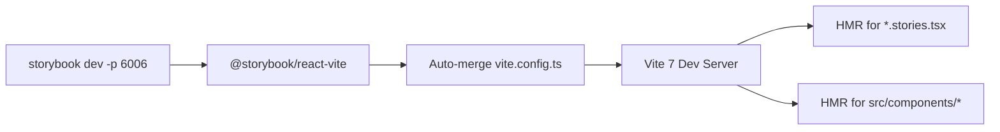
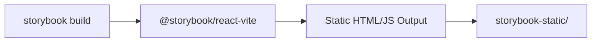
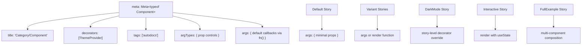

# Technical Specification

# 0. Agent Action Plan

## 0.1 Intent Clarification

### 0.1.1 Core Feature Objective

Based on the prompt, the Blitzy platform understands that the new feature requirement is to **add comprehensive Storybook story files for all 30 existing React wrapper components** in the `material-ui-component-lib-project-1` library. This involves:

- **Installing and configuring Storybook 8+** as a development-time UI component workshop, fully integrated with the project's existing Vite 7 build toolchain and MUI v7 theming system
- **Creating 30 production-ready `.stories.tsx` files** — one for each wrapper component — following CSF3 (Component Story Format 3) conventions with strict TypeScript typing
- **Establishing Storybook infrastructure from scratch** — the repository currently contains zero Storybook configuration, addons, or story files; every artifact must be newly created
- **Wrapping all stories in the library's own `ThemeProvider`** (from `src/theme/ThemeProvider.tsx`) to ensure consistent themed rendering, including dark mode support via `createCustomTheme({ palette: { mode: 'dark' } })`
- **Generating a minimum of 6–8 named story exports per component**, including `Default`, variant stories, `Disabled`, `Sizes` (where applicable), `DarkMode`, `Interactive` (for form/input components), and `FullExample` (a realistic composed use case)
- **Mapping Storybook controls** to every component prop using appropriate `argTypes` (select, boolean, text, number, action) so that consumers can interactively explore the library's component API
- **Respecting component-specific rendering guidelines** — for example, using `parameters: { layout: 'fullscreen' }` for AppBar and Drawer, using `useState` for interactive Tabs and Dialog stories, and showing all severity levels for Alert

Implicit requirements detected:

- The library's `tsconfig.build.json` already excludes `**/*.stories.*` from production type declarations, confirming that story files are architecturally anticipated but not yet created
- Since Storybook 8.x has a peer dependency on `vite: "^4.0.0 || ^5.0.0"`, and this project uses Vite 7.3.1, the actual Storybook version must be **Storybook 10.x** (the latest stable line), which is the first version that supports Vite 7 — the user's "Storybook 8+" designation means "version 8 or higher"
- All 30 components use `React.forwardRef` with named exports only — stories must import from relative paths within the library (never from `@mui/material` directly)
- Components that re-export sub-components (Card, Dialog, Table, List, Tabs, AppBar, Select, Radio) require stories that demonstrate compound composition patterns
- The `@storybook/test` package provides the `fn()` utility for mocking callback props — this is required per the user's story writing rules

### 0.1.2 Special Instructions and Constraints

The user provided explicit directives that must be followed without deviation:

- **ThemeProvider wrapping is mandatory**: Every story must be wrapped via a `decorators` array using the library's own `ThemeProvider` (imported from `../../theme/ThemeProvider` relative to each component), not MUI's `ThemeProvider` directly
- **Never import from `@mui/material` directly in stories**: All component imports must come from the library itself — either the relative component path (`'./Button'`) or the library barrel (`'../../index'`)
- **CSF3 format with strict TypeScript**: All stories use `Meta<typeof ComponentName>` and `StoryObj<typeof meta>` type patterns with zero `any` types and no type assertions
- **Use `fn()` from `@storybook/test`** for callback prop mocking (e.g., `onClick: fn()`)
- **Use MUI `sx` prop only** — no hardcoded inline styles; all styling must use theme tokens
- **Autodocs tag required**: Every meta object must include `tags: ['autodocs']`
- **Description required**: Every story and component must have `parameters.docs.description` entries
- **No placeholder comments**: Every line of generated code must be real, working code
- **Side-by-side variants**: Use `<Stack direction="row" spacing={2} alignItems="center">` for rendering multiple variants together

Architectural constraints from the existing codebase:

- Named exports only — no default exports for components (barrel exports enforce this)
- `sideEffects: false` in `package.json` — stories must not introduce runtime side effects into the library build
- The `@` path alias resolves to `src/` (per `vite.config.ts`) but stories should use relative imports for colocation clarity

User Example (preserved exactly as provided — Button story):
```tsx
// See the user's complete Button example in the prompt
// demonstrating Default, Variants, Colors, Sizes,
// Disabled, DarkMode, and FullExample stories
```

### 0.1.3 Technical Interpretation

These feature requirements translate to the following technical implementation strategy:

- To **configure Storybook**, we will create a `.storybook/` directory at the repository root containing `main.ts` (framework configuration pointing to `@storybook/react-vite`) and `preview.ts` (global decorators including `ThemeProvider` wrapping and shared parameters)
- To **generate story files**, we will create one `<ComponentName>.stories.tsx` file adjacent to each component's source file inside its category folder (e.g., `src/components/core/Button/Button.stories.tsx`)
- To **support dark mode stories**, we will import `createCustomTheme` from the theme system and create a dark theme variant inside story-level decorators using `createCustomTheme({ palette: { mode: 'dark' } })`
- To **support interactive stories**, we will use React `useState` inside `render` functions for form controls (TextField, Select, Checkbox, Radio, Switch, Tabs, Dialog, Snackbar, Drawer)
- To **support compound component stories**, we will import all sub-components from the library (e.g., `Card`, `CardHeader`, `CardContent`, `CardActions`, `CardMedia`) and demonstrate realistic composition
- To **enable prop controls**, we will map every public prop to Storybook argTypes with appropriate control types (select for enums, boolean for flags, text for strings, `fn()` for callbacks)
- To **update the build system**, we will add Storybook dev dependencies to `package.json` and add `storybook` and `build-storybook` npm scripts
- To **maintain build isolation**, we will rely on the existing `tsconfig.build.json` exclusion of `**/*.stories.*` to keep story files out of the distributable library output

## 0.2 Repository Scope Discovery

### 0.2.1 Comprehensive File Analysis

**Existing files requiring modification:**

| File Path | Modification Purpose |
|-----------|---------------------|
| `package.json` | Add Storybook devDependencies, add `storybook` and `build-storybook` npm scripts, add `storybook-static` to files exclusion if needed |
| `.eslintrc.cjs` | Add Storybook-specific ESLint configuration (extend `plugin:storybook/recommended`) |

**Component source files analyzed (read-only reference — not modified, but each drives a corresponding story file):**

| Category | Component File | Wrapper Pattern | Sub-Components / Companions |
|----------|---------------|----------------|----------------------------|
| core | `src/components/core/Button/Button.tsx` | A — Simple Forward | — |
| core | `src/components/core/TextField/TextField.tsx` | A — Simple Forward | — |
| core | `src/components/core/Select/Select.tsx` | A — Simple Forward | Re-exports `MenuItem`, `MenuItemProps` |
| core | `src/components/core/Checkbox/Checkbox.tsx` | B — Conditional Label | Optional `label`, `labelPlacement` → `FormControlLabel` |
| core | `src/components/core/Radio/Radio.tsx` | B — Conditional Label | Re-exports `RadioGroup`, `RadioGroupProps` |
| core | `src/components/core/Switch/Switch.tsx` | B — Conditional Label | Optional `label`, `labelPlacement` → `FormControlLabel` |
| core | `src/components/core/IconButton/IconButton.tsx` | C — Accessibility Enforcing | Required `aria-label` string prop |
| layout | `src/components/layout/Box/Box.tsx` | A — Simple Forward | — |
| layout | `src/components/layout/Container/Container.tsx` | A — Simple Forward | — |
| layout | `src/components/layout/Grid/Grid.tsx` | A — Simple Forward | — |
| layout | `src/components/layout/Stack/Stack.tsx` | A — Simple Forward | — |
| layout | `src/components/layout/Divider/Divider.tsx` | A — Simple Forward | — |
| layout | `src/components/layout/Paper/Paper.tsx` | A — Simple Forward | — |
| navigation | `src/components/navigation/AppBar/AppBar.tsx` | D — Compound | Exports `Toolbar`, `ToolbarProps` |
| navigation | `src/components/navigation/Tabs/Tabs.tsx` | D — Compound | Exports `Tab`, `TabProps` |
| navigation | `src/components/navigation/Drawer/Drawer.tsx` | A — Simple Forward | — |
| navigation | `src/components/navigation/Breadcrumbs/Breadcrumbs.tsx` | A — Simple Forward | — |
| navigation | `src/components/navigation/Link/Link.tsx` | A — Simple Forward | — |
| data-display | `src/components/data-display/Typography/Typography.tsx` | A — Simple Forward | — |
| data-display | `src/components/data-display/Card/Card.tsx` | D — Compound | Exports `CardHeader`, `CardContent`, `CardActions`, `CardMedia` + Props |
| data-display | `src/components/data-display/Table/Table.tsx` | D — Compound | Exports `TableHead`, `TableBody`, `TableRow`, `TableCell` + Props |
| data-display | `src/components/data-display/List/List.tsx` | D — Compound | Exports `ListItem`, `ListItemText`, `ListItemIcon`, `ListItemButton` + Props |
| data-display | `src/components/data-display/Avatar/Avatar.tsx` | A — Simple Forward | — |
| data-display | `src/components/data-display/Chip/Chip.tsx` | A — Simple Forward | — |
| data-display | `src/components/data-display/Tooltip/Tooltip.tsx` | A — Simple Forward | — |
| feedback | `src/components/feedback/Alert/Alert.tsx` | A — Simple Forward | — |
| feedback | `src/components/feedback/Dialog/Dialog.tsx` | D — Compound | Exports `DialogTitle`, `DialogContent`, `DialogActions` + Props |
| feedback | `src/components/feedback/Snackbar/Snackbar.tsx` | A — Simple Forward | — |
| feedback | `src/components/feedback/CircularProgress/CircularProgress.tsx` | A — Simple Forward | — |
| feedback | `src/components/feedback/LinearProgress/LinearProgress.tsx` | A — Simple Forward | — |

**Integration point discovery:**

- **Theme Context**: Every story requires `ThemeProvider` (from `src/theme/ThemeProvider.tsx`) as a decorator — this is the primary integration point between the story layer and the library's runtime
- **Dark Mode**: Stories using dark mode decorators integrate with `createCustomTheme` (from `src/theme/createCustomTheme.ts`) by passing `{ palette: { mode: 'dark' } }`
- **Barrel Exports**: Category barrel files (`src/components/core/index.ts`, etc.) define the canonical export surface — story imports should use relative paths to collocated components, but `FullExample` stories that compose across categories may import from category barrels
- **Build Pipeline**: `vite.config.ts` library mode configuration must not be disrupted — Storybook runs its own Vite dev server via `@storybook/react-vite` and merges the project's `vite.config.ts` automatically
- **TypeScript Configuration**: `tsconfig.json` applies to Storybook dev mode; `tsconfig.build.json` already excludes `**/*.stories.*` from declarations

### 0.2.2 New File Requirements

**Storybook configuration files to create:**

| File Path | Purpose |
|-----------|---------|
| `.storybook/main.ts` | Storybook configuration — framework (`@storybook/react-vite`), story globs, addons, docs plugin |
| `.storybook/preview.ts` | Global decorators (ThemeProvider wrapping), shared parameters (layout, docs), global argTypes |

**Story files to create (30 files, one per component):**

| File Path | Component | Category |
|-----------|-----------|----------|
| `src/components/core/Button/Button.stories.tsx` | Button | Core |
| `src/components/core/TextField/TextField.stories.tsx` | TextField | Core |
| `src/components/core/Select/Select.stories.tsx` | Select | Core |
| `src/components/core/Checkbox/Checkbox.stories.tsx` | Checkbox | Core |
| `src/components/core/Radio/Radio.stories.tsx` | Radio | Core |
| `src/components/core/Switch/Switch.stories.tsx` | Switch | Core |
| `src/components/core/IconButton/IconButton.stories.tsx` | IconButton | Core |
| `src/components/layout/Box/Box.stories.tsx` | Box | Layout |
| `src/components/layout/Container/Container.stories.tsx` | Container | Layout |
| `src/components/layout/Grid/Grid.stories.tsx` | Grid | Layout |
| `src/components/layout/Stack/Stack.stories.tsx` | Stack | Layout |
| `src/components/layout/Divider/Divider.stories.tsx` | Divider | Layout |
| `src/components/layout/Paper/Paper.stories.tsx` | Paper | Layout |
| `src/components/navigation/AppBar/AppBar.stories.tsx` | AppBar | Navigation |
| `src/components/navigation/Tabs/Tabs.stories.tsx` | Tabs | Navigation |
| `src/components/navigation/Drawer/Drawer.stories.tsx` | Drawer | Navigation |
| `src/components/navigation/Breadcrumbs/Breadcrumbs.stories.tsx` | Breadcrumbs | Navigation |
| `src/components/navigation/Link/Link.stories.tsx` | Link | Navigation |
| `src/components/data-display/Typography/Typography.stories.tsx` | Typography | Data Display |
| `src/components/data-display/Card/Card.stories.tsx` | Card | Data Display |
| `src/components/data-display/Table/Table.stories.tsx` | Table | Data Display |
| `src/components/data-display/List/List.stories.tsx` | List | Data Display |
| `src/components/data-display/Avatar/Avatar.stories.tsx` | Avatar | Data Display |
| `src/components/data-display/Chip/Chip.stories.tsx` | Chip | Data Display |
| `src/components/data-display/Tooltip/Tooltip.stories.tsx` | Tooltip | Data Display |
| `src/components/feedback/Alert/Alert.stories.tsx` | Alert | Feedback |
| `src/components/feedback/Dialog/Dialog.stories.tsx` | Dialog | Feedback |
| `src/components/feedback/Snackbar/Snackbar.stories.tsx` | Snackbar | Feedback |
| `src/components/feedback/CircularProgress/CircularProgress.stories.tsx` | CircularProgress | Feedback |
| `src/components/feedback/LinearProgress/LinearProgress.stories.tsx` | LinearProgress | Feedback |

### 0.2.3 Web Search Research Conducted

- **Storybook + Vite 7 compatibility**: Confirmed via GitHub issue #31858 that Storybook 9.x pinned `vite: ^6.2.5`, making it incompatible with Vite 7. Storybook 10.x is the first version line with Vite 7 support. The user's "Storybook 8+" requirement resolves to Storybook 10.x for this project's Vite 7.3.1 toolchain.
- **CSF3 format stability**: CSF3 (Component Story Format 3) is the default format in Storybook 8+ and remains fully supported in Storybook 10.x — `Meta<typeof C>` and `StoryObj<typeof meta>` type patterns are stable.
- **`@storybook/react-vite` framework**: This package is the canonical integration for React + Vite projects — it automatically merges the project's `vite.config.ts` into Storybook's Vite configuration, eliminating the need for a separate `viteFinal` override in most cases.
- **`@storybook/test` for `fn()`**: The `fn()` utility from `@storybook/test` provides Vitest-compatible mock functions for action logging in Storybook controls — it is the recommended replacement for the older `@storybook/addon-actions`.
- **MUI v7 + Storybook integration patterns**: MUI v7 components render correctly in Storybook when wrapped with a `ThemeProvider` decorator; `CssBaseline` (already included in this library's ThemeProvider) ensures consistent CSS reset within the Storybook iframe.

## 0.3 Dependency Inventory

### 0.3.1 Private and Public Packages

All Storybook packages are public packages from the npm registry. No private packages are required for this feature addition. The Storybook ecosystem follows a synchronized versioning scheme — all `@storybook/*` scoped packages and the `storybook` core package share the same version number within a release.

**New devDependencies to Add:**

| Registry | Package | Version | Purpose |
|----------|---------|---------|---------|
| npm | `storybook` | ^10.2.10 | Core CLI, development server, manager UI, `storybook/test` utilities |
| npm | `@storybook/react` | ^10.2.10 | React renderer, provides `Meta` and `StoryObj` TypeScript types for CSF3 |
| npm | `@storybook/react-vite` | ^10.2.10 | Vite builder integration framework, auto-merges project `vite.config.ts` |
| npm | `@storybook/test` | ^10.2.10 | Test utilities (`fn()`, `expect`, `userEvent`) for story interaction mocking |
| npm | `eslint-plugin-storybook` | ^10.2.10 | ESLint rules scoped to `*.stories.*` files, enforces CSF best practices |

**Rationale for Storybook 10.x:** Storybook 10 is the minimum major version with native Vite 7 support. Prior versions (Storybook 8.x supports Vite ^4 or ^5; Storybook 9.x supports Vite ^6) are incompatible with the project's `vite: ^7.3.1` requirement. Storybook 10 is also ESM-only, which aligns perfectly with the project's `"type": "module"` package configuration.

**Existing devDependencies (No Changes Required):**

| Registry | Package | Locked Version | Role in Storybook Context |
|----------|---------|---------------|--------------------------|
| npm | `react` | 19.2.4 | Satisfies Storybook's React peer dependency |
| npm | `react-dom` | 19.2.4 | Satisfies Storybook's ReactDOM peer dependency |
| npm | `@mui/material` | 7.3.8 | MUI components wrapped by the library's wrapper layer |
| npm | `@emotion/react` | 11.14.0 | Emotion runtime required by MUI's styling engine |
| npm | `@emotion/styled` | 11.14.1 | Emotion styled API required by MUI |
| npm | `typescript` | 5.9.3 | TypeScript compiler for story files (strict mode) |
| npm | `vite` | 7.3.1 | Build tool — Storybook's `@storybook/react-vite` framework auto-detects this |
| npm | `@vitejs/plugin-react` | 4.7.0 | React Vite plugin reused by Storybook's Vite builder |
| npm | `eslint` | 9.39.2 | Linter host for `eslint-plugin-storybook` |
| npm | `@types/react` | 19.2.14 | React type definitions for story TypeScript compilation |
| npm | `@types/react-dom` | 19.2.3 | ReactDOM type definitions for story compilation |
| npm | `prettier` | 3.8.1 | Formatter for generated `.stories.tsx` files |

All new packages are devDependencies, preserving the project's zero-production-dependency architecture (`sideEffects: false`, no runtime dependencies).

### 0.3.2 Dependency Updates

**Import Updates**

Story files will introduce the following import patterns across all 30 `*.stories.tsx` files:

- Type imports from `@storybook/react`:
  - `import type { Meta, StoryObj } from '@storybook/react'`
- Action mocking from `@storybook/test`:
  - `import { fn } from '@storybook/test'`
- Theme system imports (relative to each story file location):
  - `import { ThemeProvider } from '../../theme/ThemeProvider'`
  - `import { createCustomTheme } from '../../theme/createCustomTheme'`
- MUI layout primitives from the library's own barrel exports:
  - `import { Stack } from '../layout/Stack'` (for side-by-side variant renders)
  - `import { Box } from '../layout/Box'` (for dark mode background containers)
- Component-local imports:
  - `import { Button } from './Button'` (pattern for all 30 components)

Files requiring import additions (new files only — no existing files change imports):

| Pattern | Count | Import Sources |
|---------|-------|---------------|
| `src/components/core/*.stories.tsx` | 7 | `@storybook/react`, `@storybook/test`, `../../theme/*`, component-local |
| `src/components/layout/*.stories.tsx` | 6 | `@storybook/react`, `@storybook/test`, `../../theme/*`, component-local |
| `src/components/navigation/*.stories.tsx` | 5 | `@storybook/react`, `@storybook/test`, `../../theme/*`, component-local |
| `src/components/data-display/*.stories.tsx` | 7 | `@storybook/react`, `@storybook/test`, `../../theme/*`, component-local |
| `src/components/feedback/*.stories.tsx` | 5 | `@storybook/react`, `@storybook/test`, `../../theme/*`, component-local |

**External Reference Updates**

| File | Change Description |
|------|--------------------|
| `package.json` | Add 5 new `devDependencies` entries; add `storybook` and `build-storybook` scripts |
| `.eslintrc.cjs` | Add `'plugin:storybook/recommended'` to the `extends` array (before `'prettier'`) |
| `.gitignore` | Add `storybook-static/` to ignore Storybook's static build output directory |
| `package-lock.json` | Regenerated automatically by `npm install` after devDependency additions |

**Script Additions to `package.json`:**

```json
"storybook": "storybook dev -p 6006",
"build-storybook": "storybook build"
```

**ESLint Configuration Update in `.eslintrc.cjs`:**

The `extends` array gains `'plugin:storybook/recommended'` inserted before `'prettier'` (which must remain last):

```json
["eslint:recommended", "plugin:@typescript-eslint/recommended", "plugin:storybook/recommended", "prettier"]
```

The `eslint-plugin-storybook` plugin auto-scopes its rules to `*.stories.*` files only — no `overrides` configuration is necessary. The existing `ESLINT_USE_FLAT_CONFIG=false` flag in the lint script ensures compatibility with the legacy `.eslintrc.cjs` format under ESLint 9.

## 0.4 Integration Analysis

### 0.4.1 Existing Code Touchpoints

**Direct modifications required in existing files:**

| File | Modification | Scope |
|------|-------------|-------|
| `package.json` | Add 5 `devDependencies` (`storybook`, `@storybook/react`, `@storybook/react-vite`, `@storybook/test`, `eslint-plugin-storybook`); add `"storybook"` and `"build-storybook"` scripts | Top-level `devDependencies` and `scripts` objects |
| `.eslintrc.cjs` | Insert `'plugin:storybook/recommended'` into the `extends` array before `'prettier'` | Line within the `extends` array (currently 3 entries, becomes 4) |
| `.gitignore` | Append `storybook-static/` entry under the "Build output" section | New line after `dist/` |
| `tsconfig.json` | Extend `include` from `["src"]` to `["src", ".storybook"]` for IDE type-checking support of Storybook configuration files | `include` array only — no `compilerOptions` changes |

**Files confirmed as NO modification required:**

| File | Reason |
|------|--------|
| `tsconfig.build.json` | Already excludes `**/*.stories.*` in its `exclude` array — story files are automatically omitted from declaration generation |
| `vite.config.ts` | `@storybook/react-vite` auto-merges the project's `vite.config.ts` at runtime — no manual Storybook-specific entries needed |
| `src/index.ts` | Root barrel export is unaffected — story files are not exported from the library |
| `src/components/index.ts` | Component barrel remains unchanged — stories have no barrel exports |
| `src/theme/index.ts` | Theme barrel remains unchanged — stories import theme modules directly via relative paths |
| All existing `src/components/*/index.ts` barrels | Per-component barrel exports remain unchanged — stories are standalone files |

### 0.4.2 Theme System Integration

The library's theme system is the primary integration surface between Storybook and the component library.

**ThemeProvider Decorator Chain:**

Every story renders within the library's `ThemeProvider` (from `src/theme/ThemeProvider.tsx`), which wraps MUI's `ThemeProvider` and `CssBaseline`. This is configured globally via the `.storybook/preview.ts` decorators array and applied at the `meta` level in each story file:

```tsx
decorators: [(Story) => (<ThemeProvider><Story /></ThemeProvider>)]
```

**Dark Mode Integration:**

Dark mode stories override the global decorator with a story-level decorator using `createCustomTheme` (from `src/theme/createCustomTheme.ts`):

```tsx
const darkTheme = createCustomTheme({ palette: { mode: 'dark' } });
```

This leverages the existing theme factory, which internally composes 6 token modules (colors, typography, spacing, breakpoints, shadows, shape) with `cssVariables: true`.

**Token Modules Exercised by Stories:**

| Token Module | File | Story Usage |
|-------------|------|-------------|
| Colors | `src/theme/tokens/colors.ts` | Button colors, Alert severities, Chip variants |
| Typography | `src/theme/tokens/typography.ts` | Typography variant scale (`h1`–`caption`) |
| Spacing | `src/theme/tokens/spacing.ts` | Stack spacing props, Box padding |
| Breakpoints | `src/theme/tokens/breakpoints.ts` | Grid responsive props (`xs`, `sm`, `md`) |
| Shadows | `src/theme/tokens/shadows.ts` | Paper elevation, Card raised variant |
| Shape | `src/theme/tokens/shape.ts` | Border radius on Button, Paper, Card |

### 0.4.3 Build Pipeline Integration

**Development Mode (Storybook dev server):**



- The `@storybook/react-vite` framework reads the project's `vite.config.ts` and applies its `react()` plugin, `resolve.alias`, and other settings automatically
- Story files and component source files both benefit from Vite's HMR
- The Storybook dev server runs on port 6006 (configurable), independent of any library build process

**Production Build (Storybook static):**



- `storybook build` produces a deployable static site in `storybook-static/`
- This output is `.gitignore`-d and not part of the npm package (the `files` field in `package.json` only includes `dist/`)
- The library's own `build` script (`vite build && tsc --project tsconfig.build.json`) is completely unaffected

**TypeScript Compilation Boundaries:**

| Config | Includes Stories? | Includes `.storybook/`? | Purpose |
|--------|------------------|------------------------|---------|
| `tsconfig.json` | Yes (within `src`) | Yes (after modification) | IDE type-checking, general development |
| `tsconfig.build.json` | No (`**/*.stories.*` excluded) | No (`src/**/*` only) | Library build — declaration generation |

### 0.4.4 Component Wrapper Pattern Integration

Stories must adapt to the four distinct wrapper patterns identified in the codebase:

**Pattern A — Simple Forward (17 components):**
Direct prop spread to MUI primitives. Stories exercise `variant`, `color`, `size`, and other MUI props passed through without transformation.

- Components: Button, TextField, Select, Typography, Box, Container, Grid, Stack, Divider, Paper, Avatar, Chip, Tooltip, Link, Breadcrumbs, CircularProgress, LinearProgress
- Story integration: Standard `args` objects map directly to MUI prop interfaces

**Pattern B — Conditional Label (3 components):**
Optional `label` and `labelPlacement` props that conditionally wrap in `FormControlLabel`. Stories must demonstrate both bare and labeled usage.

- Components: Checkbox, Radio, Switch
- Story integration: Separate stories for "with label" and "without label" states; RadioGroup composition for Radio

**Pattern C — Accessibility Enforcing (1 component):**
`aria-label` is a required `string` prop (not optional). Stories must always provide valid `aria-label` values.

- Component: IconButton
- Story integration: Every story includes a meaningful `aria-label` arg; argTypes marks it as a required text control

**Pattern D — Compound Components (7+ components):**
Re-export companion sub-components. Stories compose parent and child components together in realistic arrangements.

- Components: Card (+ CardHeader/Content/Actions/Media), Dialog (+ DialogTitle/Content/Actions), Table (+ TableHead/Body/Row/Cell), List (+ ListItem/ItemText/ItemIcon/ItemButton), Tabs (+ Tab), AppBar (+ Toolbar), Select (+ MenuItem)
- Story integration: `FullExample` stories compose all sub-components; companion components imported from the same directory or via library barrel

### 0.4.5 Storybook Configuration Integration Points

**`.storybook/main.ts` — Framework and Story Discovery:**

| Configuration Key | Value | Integration Target |
|-------------------|-------|--------------------|
| `framework` | `'@storybook/react-vite'` | Connects to Vite 7 build toolchain |
| `stories` | `['../src/**/*.stories.@(ts\|tsx)']` | Discovers all 30 story files colocated with components |
| `addons` | `['@storybook/addon-essentials']` | Bundled with `storybook` core — docs, controls, actions, viewport |
| `typescript.reactDocgen` | `'react-docgen-typescript'` | Extracts prop tables from component TypeScript interfaces |

**`.storybook/preview.ts` — Global Decorators and Parameters:**

| Configuration Key | Value | Integration Target |
|-------------------|-------|--------------------|
| `decorators` | `[ThemeProvider wrapper]` | Global theme context for every story |
| `parameters.layout` | `'centered'` (default) | Standard centered layout for most components |
| `parameters.controls.matchers` | Date and color matchers | Auto-detect control types from prop names |

The `StorybookConfig` type from `@storybook/react-vite` provides full TypeScript autocompletion for `main.ts`. The `Preview` type from `@storybook/react` types the `preview.ts` exports.

## 0.5 Design System Compliance

### 0.5.1 System Identification

- **Library:** Material UI (MUI), **Version:** 7.3.8, **Status:** Installed (devDependency + peerDependency)
- **Package:** `@mui/material` (npm registry)
- **Wrapper Layer:** This project IS a design-system-aligned wrapper library — the 30 components in `src/components/` extend MUI primitives with a custom theme. Stories exercise the wrapper layer, not MUI directly.
- **Theme Engine:** Emotion (`@emotion/react` 11.14.0 + `@emotion/styled` 11.14.1) — CSS-in-JS runtime styling with `cssVariables: true`
- **Source Inspected:** `src/theme/createCustomTheme.ts`, `src/theme/ThemeProvider.tsx`, `src/theme/tokens/*.ts` (6 token modules), `package.json`

### 0.5.2 Component Mapping

All 30 library components wrap MUI primitives. Stories must import exclusively from the library's own exports — never from `@mui/material` directly.

| UI Element | Library Component | Import Path | Key Props / Variants | Notes |
|------------|-------------------|-------------|---------------------|-------|
| Primary Button | `Button` | `./Button` | `variant`, `color`, `size`, `disabled`, `fullWidth` | Pattern A — simple forward |
| Text Input | `TextField` | `./TextField` | `variant`, `label`, `error`, `helperText`, `placeholder` | Pattern A |
| Dropdown | `Select` | `./Select` | `value`, `onChange`, `label`, `variant` | Re-exports `MenuItem` |
| Check Option | `Checkbox` | `./Checkbox` | `checked`, `label`, `labelPlacement`, `disabled` | Pattern B — conditional FormControlLabel |
| Radio Option | `Radio` | `./Radio` | `checked`, `label`, `labelPlacement` | Pattern B; re-exports `RadioGroup` |
| Toggle | `Switch` | `./Switch` | `checked`, `label`, `labelPlacement`, `disabled` | Pattern B |
| Icon Action | `IconButton` | `./IconButton` | `aria-label` (required), `color`, `size`, `disabled` | Pattern C — accessibility enforcing |
| Layout Container | `Box` | `../layout/Box` | `sx`, `component` | Used in DarkMode story backgrounds |
| Page Container | `Container` | `../layout/Container` | `maxWidth`, `fixed`, `disableGutters` | Pattern A |
| Responsive Grid | `Grid` | `../layout/Grid` | `container`, `item`, `xs`, `sm`, `md`, `lg`, `spacing` | Pattern A |
| Linear Stack | `Stack` | `../layout/Stack` | `direction`, `spacing`, `alignItems` | Used in side-by-side variant renders |
| Separator | `Divider` | `../layout/Divider` | `orientation`, `variant`, `flexItem` | Pattern A |
| Surface | `Paper` | `../layout/Paper` | `elevation`, `variant`, `square` | Pattern A |
| Text Display | `Typography` | `../data-display/Typography` | `variant` (h1–caption), `color`, `align`, `gutterBottom` | Pattern A |
| Profile Image | `Avatar` | `../data-display/Avatar` | `src`, `alt`, `variant`, `sizes` | Pattern A |
| Tag/Label | `Chip` | `../data-display/Chip` | `label`, `color`, `variant`, `onDelete`, `clickable` | Pattern A |
| Hover Info | `Tooltip` | `../data-display/Tooltip` | `title`, `placement`, `arrow` | Pattern A |
| Compound Card | `Card` + sub-components | `../data-display/Card` | `raised`, `variant` | Pattern D — CardHeader, CardContent, CardActions, CardMedia |
| Data Table | `Table` + sub-components | `../data-display/Table` | — | Pattern D — TableHead, TableBody, TableRow, TableCell |
| Item List | `List` + sub-components | `../data-display/List` | — | Pattern D — ListItem, ListItemText, ListItemIcon, ListItemButton |
| Top Bar | `AppBar` + `Toolbar` | `../navigation/AppBar` | `position`, `color` | Pattern D; fullscreen layout |
| Tab Navigation | `Tabs` + `Tab` | `../navigation/Tabs` | `value`, `onChange`, `variant` | Pattern D; useState interactive |
| Side Panel | `Drawer` | `../navigation/Drawer` | `open`, `onClose`, `anchor`, `variant` | Pattern A; fullscreen layout |
| Hyperlink | `Link` | `../navigation/Link` | `href`, `underline`, `color`, `variant` | Pattern A |
| Path Trail | `Breadcrumbs` | `../navigation/Breadcrumbs` | `separator`, `maxItems` | Pattern A |
| Status Banner | `Alert` | `../feedback/Alert` | `severity`, `variant`, `onClose` | Pattern A; 4 severity levels |
| Modal Dialog | `Dialog` + sub-components | `../feedback/Dialog` | `open`, `onClose`, `maxWidth`, `fullWidth` | Pattern D — DialogTitle, DialogContent, DialogActions |
| Toast | `Snackbar` | `../feedback/Snackbar` | `open`, `onClose`, `autoHideDuration`, `message` | Pattern A; useState interactive |
| Circular Spinner | `CircularProgress` | `../feedback/CircularProgress` | `variant`, `value`, `color`, `size` | Pattern A |
| Progress Bar | `LinearProgress` | `../feedback/LinearProgress` | `variant`, `value`, `color`, `valueBuffer` | Pattern A |

### 0.5.3 Token Catalog

All design tokens are defined in `src/theme/tokens/` and applied via `createCustomTheme()`. Stories use these tokens exclusively through the `sx` prop with theme-aware selectors.

**Color Tokens (`src/theme/tokens/colors.ts`):**

| Semantic Name | Token Path | Value | Usage in Stories |
|--------------|------------|-------|-----------------|
| Primary | `palette.primary.main` | `#1976d2` | Button/Chip `color="primary"`, default interactive states |
| Secondary | `palette.secondary.main` | `#9c27b0` | Button/Chip `color="secondary"` |
| Error | `palette.error.main` | `#d32f2f` | Alert `severity="error"`, TextField `error` state |
| Warning | `palette.warning.main` | `#ed6c02` | Alert `severity="warning"` |
| Info | `palette.info.main` | `#0288d1` | Alert `severity="info"` |
| Success | `palette.success.main` | `#2e7d32` | Alert `severity="success"` |
| Background Default | `palette.background.default` | `#fff` | DarkMode story `bgcolor` in light mode |
| Background Paper | `palette.background.paper` | `#fff` | Paper/Card surface color |
| Text Primary | `palette.text.primary` | `rgba(0,0,0,0.87)` | Typography default |
| Text Secondary | `palette.text.secondary` | `rgba(0,0,0,0.6)` | Caption, secondary labels |

**Typography Tokens (`src/theme/tokens/typography.ts`):**

| Variant | Font Family | Size | Weight | Line Height |
|---------|------------|------|--------|-------------|
| h1 | Roboto, Arial, sans-serif | 6rem (96px) | 300 | 1.167 |
| h2 | Roboto, Arial, sans-serif | 3.75rem (60px) | 300 | 1.2 |
| h3 | Roboto, Arial, sans-serif | 3rem (48px) | 400 | 1.167 |
| h4 | Roboto, Arial, sans-serif | 2.125rem (34px) | 400 | 1.235 |
| h5 | Roboto, Arial, sans-serif | 1.5rem (24px) | 400 | 1.334 |
| h6 | Roboto, Arial, sans-serif | 1.25rem (20px) | 500 | 1.6 |
| body1 | Roboto, Arial, sans-serif | 1rem (16px) | 400 | 1.5 |
| body2 | Roboto, Arial, sans-serif | 0.875rem (14px) | 400 | 1.43 |
| caption | Roboto, Arial, sans-serif | 0.75rem (12px) | 400 | 1.66 |
| button | Roboto, Arial, sans-serif | 0.875rem (14px) | 500 | 1.75 |

**Spacing Tokens (`src/theme/tokens/spacing.ts`):**

| Factor | Pixel Value | Common Usage |
|--------|-------------|-------------|
| 0 | 0px | No spacing |
| 0.5 | 4px | Minimal gap |
| 1 | 8px | Base unit |
| 2 | 16px | Standard component padding |
| 3 | 24px | Section padding |
| 4 | 32px | Large section gap |

**Additional Tokens:**

| Category | Token Source | Key Values |
|----------|------------|------------|
| Breakpoints (`src/theme/tokens/breakpoints.ts`) | `xs: 0`, `sm: 600`, `md: 900`, `lg: 1200`, `xl: 1536` | Grid responsive stories |
| Shadows (`src/theme/tokens/shadows.ts`) | 25-level shadow array (indices 0–24) | Paper `elevation` prop |
| Shape (`src/theme/tokens/shape.ts`) | `borderRadius: 4` | Applied to all rounded components |

### 0.5.4 Compliance Principles

**Precedence Order (highest to lowest):**

- Design system compliance — every value resolves to a library theme token or library component
- Visual fidelity — render components as intended by the wrapper API
- Accessibility — semantic HTML via MUI's built-in a11y, ARIA attributes, keyboard support
- Responsive behavior — use MUI responsive primitives (`Grid` props, `Container` maxWidth)
- Code quality — clean, typed, maintainable story code

**Non-Negotiable Rules:**

- **Zero hardcoded CSS values:** Every style in stories must use the `sx` prop with theme-aware references (`'primary.light'`, `'background.default'`). Only permitted raw values: `0`, `none`, `auto`, `inherit`, `currentColor`, `transparent`, and `'100%'`
- **Library components over raw HTML:** Never use raw `<button>`, `<input>`, `<select>`, `<table>`, `<div>`, or heading elements. Always use the library's `Button`, `TextField`, `Select`, `Table`, `Box`, `Typography` equivalents
- **Library imports only:** Import all components from the library's own module paths (e.g., `./Button`, `../layout/Stack`). Never import from `@mui/material` directly — this rule applies even to `Stack` and `Box` used for story layout composition
- **Layout via library primitives:** All spacing and alignment must use `Stack` (with `direction`, `spacing`, `alignItems`) and `Box` (with `sx`) from the library's layout category

**Graceful Degradation (when the library lacks a needed element):**

- Exact component match → use directly
- Close component with prop adjustments → use with annotation (e.g., `Box` with `sx` for custom layout needs)
- All 30 MUI primitives used in the library have direct library wrapper equivalents, so no gaps exist for component coverage

### 0.5.5 Compliance Summary

The library provides complete 1:1 coverage of all MUI components used in stories — all 30 wrapper components have direct library equivalents with typed props. The 6 token modules (colors, typography, spacing, breakpoints, shadows, shape) cover every styling dimension needed for story rendering. No design system gaps exist. Zero new dependencies beyond the 5 Storybook packages are needed to maintain full compliance. All stories will use library imports exclusively, with the `sx` prop and theme-aware values for any custom styling within story compositions.

## 0.6 Technical Implementation

### 0.6.1 File-by-File Execution Plan

Every file listed below MUST be created or modified as part of this feature addition.

**Group 1 — Storybook Infrastructure (CREATE: 2 files)**

| Action | File Path | Purpose |
|--------|-----------|---------|
| CREATE | `.storybook/main.ts` | Storybook entry configuration — declares `@storybook/react-vite` framework, story glob pattern `['../src/**/*.stories.@(ts\|tsx)']`, TypeScript docgen settings, and addon registration |
| CREATE | `.storybook/preview.ts` | Global preview configuration — registers `ThemeProvider` as a global decorator, sets default `parameters.layout` to `'centered'`, configures control matchers for date and color props |

**Group 2 — Existing File Modifications (MODIFY: 4 files)**

| Action | File Path | Modification |
|--------|-----------|-------------|
| MODIFY | `package.json` | Add `storybook`, `@storybook/react`, `@storybook/react-vite`, `@storybook/test`, `eslint-plugin-storybook` to `devDependencies`; add `"storybook"` and `"build-storybook"` to `scripts` |
| MODIFY | `.eslintrc.cjs` | Insert `'plugin:storybook/recommended'` into the `extends` array before `'prettier'` |
| MODIFY | `.gitignore` | Append `storybook-static/` under the "Build output" section |
| MODIFY | `tsconfig.json` | Extend `include` from `["src"]` to `["src", ".storybook"]` |

**Group 3 — Core Component Stories (CREATE: 7 files)**

| Action | File Path | Component | Stories |
|--------|-----------|-----------|---------|
| CREATE | `src/components/core/Button.stories.tsx` | `Button` | Default, Variants (contained/outlined/text), Colors (6), Sizes (small/medium/large), Disabled, DarkMode, FullExample (form action bar) |
| CREATE | `src/components/core/TextField.stories.tsx` | `TextField` | Default, Variants (outlined/filled/standard), WithHelperText, ErrorState, Disabled, Sizes, DarkMode, Interactive (controlled input), FullExample (login form) |
| CREATE | `src/components/core/Select.stories.tsx` | `Select` + `MenuItem` | Default, Variants, WithLabel, Disabled, ErrorState, DarkMode, Interactive (controlled select), FullExample (filter form) |
| CREATE | `src/components/core/Checkbox.stories.tsx` | `Checkbox` | Default, WithLabel, LabelPlacements, Colors, Disabled, DarkMode, Interactive (checked state), FullExample (settings panel) |
| CREATE | `src/components/core/Radio.stories.tsx` | `Radio` + `RadioGroup` | Default, WithLabel, LabelPlacements, Colors, Disabled, DarkMode, Interactive (group selection), FullExample (survey question) |
| CREATE | `src/components/core/Switch.stories.tsx` | `Switch` | Default, WithLabel, LabelPlacements, Colors, Sizes, Disabled, DarkMode, Interactive (toggle state), FullExample (preferences panel) |
| CREATE | `src/components/core/IconButton.stories.tsx` | `IconButton` | Default (with aria-label), Colors, Sizes, Disabled, DarkMode, FullExample (toolbar actions) |

**Group 4 — Layout Component Stories (CREATE: 6 files)**

| Action | File Path | Component | Stories |
|--------|-----------|-----------|---------|
| CREATE | `src/components/layout/Box.stories.tsx` | `Box` | Default, WithSxProp, AsSection (component="section"), NestedBoxes, DarkMode, FullExample (card layout) |
| CREATE | `src/components/layout/Container.stories.tsx` | `Container` | Default, MaxWidthVariants (xs–xl), Fixed, DisableGutters, DarkMode, FullExample (page shell) |
| CREATE | `src/components/layout/Grid.stories.tsx` | `Grid` | Default, BasicGrid, ResponsiveColumns (xs/sm/md breakpoints), Spacing, NestedGrid, DarkMode, FullExample (dashboard layout) |
| CREATE | `src/components/layout/Stack.stories.tsx` | `Stack` | Default, Horizontal, Vertical, WithSpacing, WithDividers, AlignItems, DarkMode, FullExample (button group) |
| CREATE | `src/components/layout/Divider.stories.tsx` | `Divider` | Default, Horizontal, Vertical, WithText (middle variant), FlexItem, DarkMode, FullExample (content sections) |
| CREATE | `src/components/layout/Paper.stories.tsx` | `Paper` | Default, Elevations (0–24 subset), Outlined, Square, DarkMode, FullExample (elevated content panel) |

**Group 5 — Navigation Component Stories (CREATE: 5 files)**

| Action | File Path | Component | Stories |
|--------|-----------|-----------|---------|
| CREATE | `src/components/navigation/AppBar.stories.tsx` | `AppBar` + `Toolbar` | Default (fullscreen), ColorVariants, WithIconButtons, DarkMode, FullExample (app header with nav) |
| CREATE | `src/components/navigation/Tabs.stories.tsx` | `Tabs` + `Tab` | Default, Variants (standard/fullWidth/scrollable), Disabled tab, DarkMode, Interactive (tab switching via useState), FullExample (tabbed content panel) |
| CREATE | `src/components/navigation/Drawer.stories.tsx` | `Drawer` | Default (fullscreen), Anchors (left/right/top/bottom), Variants (temporary/persistent/permanent), DarkMode, Interactive (open/close toggle), FullExample (side navigation) |
| CREATE | `src/components/navigation/Link.stories.tsx` | `Link` | Default, UnderlineVariants (always/hover/none), Colors, DarkMode, FullExample (footer navigation) |
| CREATE | `src/components/navigation/Breadcrumbs.stories.tsx` | `Breadcrumbs` | Default, CustomSeparator, MaxItems (collapsed), WithLinks, DarkMode, FullExample (page header with breadcrumbs) |

**Group 6 — Data Display Component Stories (CREATE: 7 files)**

| Action | File Path | Component | Stories |
|--------|-----------|-----------|---------|
| CREATE | `src/components/data-display/Typography.stories.tsx` | `Typography` | Default, AllVariants (h1–caption scale), Colors, Alignment, GutterBottom, DarkMode, FullExample (article layout) |
| CREATE | `src/components/data-display/Avatar.stories.tsx` | `Avatar` | Default, ImageAvatar, LetterAvatar, Variants (circular/rounded/square), Sizes, DarkMode, FullExample (user list) |
| CREATE | `src/components/data-display/Chip.stories.tsx` | `Chip` | Default, Variants (filled/outlined), Colors, Deletable, Clickable, WithIcon, Sizes, Disabled, DarkMode, FullExample (filter tags) |
| CREATE | `src/components/data-display/Tooltip.stories.tsx` | `Tooltip` | Default, Placements (top/bottom/left/right), Arrow, DarkMode, FullExample (icon toolbar with tooltips) |
| CREATE | `src/components/data-display/Card.stories.tsx` | `Card` + sub-components | Default, WithMedia, Raised, OutlinedVariant, DarkMode, FullExample (product card with header, content, media, actions) |
| CREATE | `src/components/data-display/Table.stories.tsx` | `Table` + sub-components | Default, DenseTable, DarkMode, FullExample (data grid with 5 columns, 3–5 rows, realistic headers) |
| CREATE | `src/components/data-display/List.stories.tsx` | `List` + sub-components | Default, WithIcons, WithSecondaryText, Interactive (ListItemButton), DarkMode, FullExample (settings menu) |

**Group 7 — Feedback Component Stories (CREATE: 5 files)**

| Action | File Path | Component | Stories |
|--------|-----------|-----------|---------|
| CREATE | `src/components/feedback/Alert.stories.tsx` | `Alert` | Default, Severities (success/info/warning/error), Variants (standard/filled/outlined), WithClose, DarkMode, FullExample (notification stack with all 4 severities) |
| CREATE | `src/components/feedback/Dialog.stories.tsx` | `Dialog` + sub-components | Default, MaxWidthVariants, FullWidth, DarkMode, Interactive (open/close via useState), FullExample (confirmation dialog with title, content, cancel/confirm actions) |
| CREATE | `src/components/feedback/Snackbar.stories.tsx` | `Snackbar` | Default, AnchorOrigins, AutoHideDuration, WithAlert, DarkMode, Interactive (show/hide via useState), FullExample (notification system) |
| CREATE | `src/components/feedback/CircularProgress.stories.tsx` | `CircularProgress` | Default, Determinate, Indeterminate, Colors, Sizes, DarkMode, FullExample (loading overlay) |
| CREATE | `src/components/feedback/LinearProgress.stories.tsx` | `LinearProgress` | Default, Determinate, Indeterminate, Buffer, Colors, DarkMode, Interactive (progress slider control), FullExample (file upload progress) |

### 0.6.2 Implementation Approach per File

**Step 1 — Establish Storybook Infrastructure:**

Create `.storybook/main.ts` and `.storybook/preview.ts` first. These files configure the framework, story discovery, global decorators, and parameter defaults. All 30 story files depend on this infrastructure being in place.

The `main.ts` configuration specifies the `@storybook/react-vite` framework, which auto-detects and merges the project's `vite.config.ts` (including the `react()` plugin, `resolve.alias`, and externals). The `preview.ts` registers `ThemeProvider` as a global decorator so all stories render within the library's theme context.

**Step 2 — Modify Existing Configuration:**

Update `package.json` (devDependencies + scripts), `.eslintrc.cjs` (Storybook ESLint plugin), `.gitignore` (build output exclusion), and `tsconfig.json` (include `.storybook/` for IDE support). These changes enable the Storybook toolchain and ensure linting, type checking, and version control work correctly with the new files.

**Step 3 — Generate Story Files per Category:**

Implement all 30 story files following the CSF3 format. Each story file follows this consistent structure:

- **Meta export:** Component title in `Category/ComponentName` format, component reference, ThemeProvider decorator, `['autodocs']` tag, `argTypes` mapping every prop to a Storybook control
- **Default story:** Minimal props with `args` for controls panel interactivity
- **Variant stories:** One story per meaningful variant or prop combination
- **DarkMode story:** Story-level decorator overriding ThemeProvider with `createCustomTheme({ palette: { mode: 'dark' } })`
- **Interactive story** (for stateful components): Uses `render` function with `React.useState` for real interactivity
- **FullExample story:** Realistic composition combining multiple library components

**Step 4 — Validate and Document:**

Verify all story files compile under TypeScript strict mode, render correctly with the ThemeProvider decorator, and produce working Storybook controls. Confirm `eslint-plugin-storybook` rules pass for all `*.stories.tsx` files.

### 0.6.3 Story Architecture Pattern

All 30 story files follow an identical structural template:



**Per-Category Implementation Notes:**

- **Core components:** Must demonstrate all `variant` × `color` combinations; form components (`TextField`, `Select`, `Checkbox`, `Radio`, `Switch`) need `Interactive` stories with controlled state; `IconButton` requires `aria-label` in every story
- **Layout components:** Use `parameters: { layout: 'padded' }` for full-width rendering; Grid stories show responsive breakpoint behavior with colored Box placeholders; Paper shows elevation progression
- **Navigation components:** `AppBar` and `Drawer` use `parameters: { layout: 'fullscreen' }`; `Tabs` and `Drawer` require `useState` for open/close and tab switching interactivity
- **Data Display components:** `Typography` demonstrates full variant scale (h1–caption); `Table` uses realistic column headers and 3–5 data rows; `Card` composes all sub-components (Header, Content, Media, Actions)
- **Feedback components:** `Dialog` and `Snackbar` require `useState` for open/close control; `Alert` FullExample shows all 4 severities stacked; `LinearProgress` Interactive uses a slider-style control to demonstrate determinate value changes

## 0.7 Scope Boundaries

### 0.7.1 Exhaustively In Scope

**Storybook Configuration Files:**

| Pattern | Files | Purpose |
|---------|-------|---------|
| `.storybook/main.ts` | 1 | Framework, story globs, addons, TypeScript docgen |
| `.storybook/preview.ts` | 1 | Global ThemeProvider decorator, default parameters |

**Story Source Files (all newly created):**

| Pattern | Files | Purpose |
|---------|-------|---------|
| `src/components/core/*.stories.tsx` | 7 | Button, TextField, Select, Checkbox, Radio, Switch, IconButton |
| `src/components/layout/*.stories.tsx` | 6 | Box, Container, Grid, Stack, Divider, Paper |
| `src/components/navigation/*.stories.tsx` | 5 | AppBar, Tabs, Drawer, Link, Breadcrumbs |
| `src/components/data-display/*.stories.tsx` | 7 | Typography, Avatar, Chip, Tooltip, Card, Table, List |
| `src/components/feedback/*.stories.tsx` | 5 | Alert, Dialog, Snackbar, CircularProgress, LinearProgress |

**Existing Files Requiring Modification:**

| File | Modification Scope |
|------|--------------------|
| `package.json` | `devDependencies` additions (5 packages), `scripts` additions (2 entries) |
| `.eslintrc.cjs` | `extends` array modification (1 entry addition) |
| `.gitignore` | Append 1 line (`storybook-static/`) |
| `tsconfig.json` | `include` array extension (add `.storybook`) |

**Existing Files Read But Not Modified (consumed as dependencies by stories):**

| Pattern | Files | Role |
|---------|-------|------|
| `src/components/core/*.tsx` | 7 | Component implementations imported by core stories |
| `src/components/layout/*.tsx` | 6 | Component implementations imported by layout stories |
| `src/components/navigation/*.tsx` | 5 | Component implementations imported by navigation stories |
| `src/components/data-display/*.tsx` | 7 | Component implementations imported by data-display stories |
| `src/components/feedback/*.tsx` | 5 | Component implementations imported by feedback stories |
| `src/theme/ThemeProvider.tsx` | 1 | Imported in `.storybook/preview.ts` and in every story decorator |
| `src/theme/createCustomTheme.ts` | 1 | Imported in DarkMode stories for dark theme creation |
| `src/theme/tokens/*.ts` | 6 | Indirectly exercised via ThemeProvider — not directly imported by stories |
| `src/types/index.ts` | 1 | Type definitions used by component prop interfaces |
| `vite.config.ts` | 1 | Auto-merged by `@storybook/react-vite` at runtime |
| `tsconfig.build.json` | 1 | Verified to already exclude `**/*.stories.*` — no modification needed |

**Build Output (generated, gitignored):**

| Pattern | Purpose |
|---------|---------|
| `storybook-static/**` | Static Storybook build output from `storybook build` |

**Total File Count:**

| Category | Create | Modify | Total Touched |
|----------|--------|--------|---------------|
| Storybook config | 2 | 0 | 2 |
| Story files | 30 | 0 | 30 |
| Project config | 0 | 4 | 4 |
| **Totals** | **32** | **4** | **36** |

### 0.7.2 Explicitly Out of Scope

- **Component source code:** No modifications to any existing `src/components/**/*.tsx` files — stories consume components as-is through their current public APIs
- **Theme token values:** No changes to `src/theme/tokens/*.ts` — the token catalog is read-only for story purposes
- **ThemeProvider or createCustomTheme logic:** No modifications to `src/theme/ThemeProvider.tsx` or `src/theme/createCustomTheme.ts`
- **Barrel export files:** No changes to `src/index.ts`, `src/components/index.ts`, `src/components/*/index.ts`, or `src/theme/index.ts`
- **Shared type definitions:** No changes to `src/types/index.ts`
- **Library build output:** The `vite build` and `tsc --project tsconfig.build.json` pipeline is unaffected — `tsconfig.build.json` already excludes `**/*.stories.*`
- **Vite configuration:** `vite.config.ts` is not modified — `@storybook/react-vite` auto-merges it
- **Test infrastructure:** No test files (unit, integration, or e2e) are created or modified — Storybook stories serve as visual documentation, not automated test suites
- **CI/CD pipeline:** No `.github/workflows/` or CI configuration files are created or modified
- **Documentation files:** No changes to `README.md`, `LICENSE`, or any markdown documentation
- **Performance optimization:** No code splitting, lazy loading, or build performance changes beyond what Storybook provides by default
- **Accessibility auditing tooling:** No `@storybook/addon-a11y` or WCAG compliance tooling is added — accessibility is enforced through component-level patterns (e.g., required `aria-label` on IconButton)
- **Visual regression testing:** No Chromatic, Percy, or similar visual testing infrastructure
- **Storybook addons beyond essentials:** No additional addons beyond `@storybook/addon-essentials` (which is bundled with the `storybook` core package)

## 0.8 Rules for Feature Addition

### 0.8.1 Story File Conventions

- **File naming:** Every story file is named `<ComponentName>.stories.tsx` and colocated in the same directory as the component it documents (e.g., `src/components/core/Button.stories.tsx` alongside `src/components/core/Button.tsx`)
- **CSF3 format only:** All stories use Component Story Format 3 with `Meta<typeof Component>` and `StoryObj<typeof meta>` types — no legacy `storiesOf()` API, no CSF1/CSF2 patterns
- **Named exports only:** Every story is a named export (`export const Default: Story = { ... }`). The only default export is the `meta` object. This aligns with the library's "named exports only" architectural rule
- **No placeholder comments:** Every line in a story file must be real, compilable TypeScript code. No `// TODO`, no `// Add implementation here`, no stub functions

### 0.8.2 Import Rules

- **Never import from `@mui/material` directly:** All components (including `Stack`, `Box`, `Typography`) must be imported from the library's own component paths. User Example: The user's prompt says `import { Stack } from '@mui/material'` in their example, but also explicitly states rule #3: "Never import from `@mui/material` directly — import everything from the library." The rule takes precedence — import `Stack` from `../layout/Stack` (or the relative library path appropriate to the story file's location)
- **Type imports use `import type` syntax:** `import type { Meta, StoryObj } from '@storybook/react'` — always use the `type` keyword for type-only imports per TypeScript strict mode conventions
- **Action mocking uses `@storybook/test`:** `import { fn } from '@storybook/test'` — the `fn()` function replaces legacy `action()` from `@storybook/addon-actions`
- **Theme imports use relative paths:** `import { ThemeProvider } from '../../theme/ThemeProvider'` and `import { createCustomTheme } from '../../theme/createCustomTheme'` — use the deepest specific module path, not barrel re-exports
- **Companion sub-components import from the same component directory:** For compound components, import sub-components from the component's barrel — e.g., `import { Card, CardHeader, CardContent, CardActions, CardMedia } from './Card'`

### 0.8.3 ThemeProvider Rules

- **Every story must render within ThemeProvider:** This is enforced via the meta-level `decorators` array in every story file AND the global decorator in `.storybook/preview.ts`
- **DarkMode stories override at the story level:** Dark mode stories replace the global ThemeProvider with a story-level decorator that uses `createCustomTheme({ palette: { mode: 'dark' } })` and wraps content in a `Box` with `sx={{ p: 3, bgcolor: 'background.default', minHeight: '100px' }}`
- **ThemeProvider is the library's own wrapper:** Always use `ThemeProvider` from `src/theme/ThemeProvider.tsx` — never import MUI's `ThemeProvider` directly from `@mui/material/styles`

### 0.8.4 TypeScript Strict Mode Rules

- **No `any` types:** TypeScript strict mode is active (`strict: true`, `noImplicitAny: true`). Stories must not use `any` or type assertions (`as any`) unless absolutely unavoidable
- **No type assertions unless necessary:** Prefer proper typing over `as` casts. When MUI component color arrays are used in `.map()` renders, use `as const` on the source array — e.g., `(['primary', 'secondary', 'error'] as const).map(...)`
- **Unused variables forbidden:** `noUnusedLocals: true` and `noUnusedParameters: true` are active — every import and variable must be consumed
- **`React.forwardRef`-compatible props:** Stories pass props through `args` which are spread onto components. Since all 30 library components use `React.forwardRef`, story args are fully compatible without ref-related special handling

### 0.8.5 Styling Rules

- **`sx` prop only:** All inline styling in stories must use MUI's `sx` prop with theme-aware values. No `style` attribute, no `className` with external CSS, no Emotion `css` prop directly
- **Theme token references:** Use semantic token paths in `sx` — `bgcolor: 'primary.light'`, `color: 'text.secondary'`, `p: 2` (spacing factor), `borderRadius: 1` (shape token multiplier)
- **No CSS-in-JS outside `sx`:** Do not create `styled()` components or `makeStyles()` within story files — stories demonstrate component usage, not custom styling patterns

### 0.8.6 Story Content Rules

- **`args` on Default and variant stories:** The `Default` story and all single-variant stories must use `args` so the Storybook controls panel works interactively
- **`render` function for compositions:** Stories showing multiple components side-by-side (Sizes, Colors, FullExample) use `render` functions. Callback props in `render` functions use `fn()` from `@storybook/test`
- **`useState` for interactive stories:** Form inputs (`TextField`, `Select`, `Checkbox`, `Radio`, `Switch`) and stateful components (`Dialog`, `Snackbar`, `Drawer`, `Tabs`) include an `Interactive` story using `React.useState` inside a `render` function
- **JSDoc description on every story:** Use `parameters.docs.description.story` to add a one-sentence description to every named story export
- **Side-by-side variants use `Stack`:** When rendering multiple component instances in a row, wrap them in `<Stack direction="row" spacing={2} alignItems="center">` from the library's layout category
- **Realistic data in FullExample stories:** `Table` stories use realistic column headers (e.g., "Name", "Email", "Role") with 3–5 data rows. `Card` stories use descriptive text and placeholder content. Avoid lorem ipsum — use domain-appropriate placeholder data
- **`argTypes` maps every public prop:** Each story's meta `argTypes` object maps every meaningful prop to a Storybook control — `select` for enums, `boolean` for flags, `text` for strings, `number` for numeric, `action` or `fn()` for callbacks. Internal or complex props (e.g., `ref`, `sx`) are hidden via `{ table: { disable: true } }`

### 0.8.7 Layout Parameter Rules

- **Default:** `parameters: { layout: 'centered' }` — used for most components
- **Fullscreen:** `parameters: { layout: 'fullscreen' }` — required for `AppBar`, `Drawer`, and any component that spans the full viewport
- **Padded:** `parameters: { layout: 'padded' }` — optional for layout components (`Grid`, `Container`) that need surrounding space

### 0.8.8 Accessibility Rules

- **`IconButton` stories always include `aria-label`:** Since `IconButton` enforces `aria-label` as a required string prop, every story must provide a meaningful label (e.g., `"Delete item"`, `"Open menu"`)
- **All interactive stories remain keyboard-accessible:** Since the library wraps MUI components that already provide WCAG 2.1 AA compliance, stories inherit this behavior. No additional ARIA attributes need to be added in story code beyond what the component API requires

## 0.9 References

### 0.9.1 Repository Files and Folders Searched

The following files and directories were inspected during the analysis phase to derive the conclusions documented in this Agent Action Plan.

**Root Configuration Files:**

| File Path | Purpose of Inspection |
|-----------|-----------------------|
| `package.json` | Identified devDependencies, peerDependencies, scripts, `"type": "module"`, `sideEffects: false`, `files` field, Node/npm engine requirements |
| `package-lock.json` | Verified exact resolved versions of all 16 dependencies (lockfileVersion 3, 274 resolved packages) |
| `vite.config.ts` | Confirmed library-mode build, dual ESM+CJS output, peer dependency externalization, `react()` plugin, `@/` alias |
| `tsconfig.json` | Verified `include: ["src"]`, strict mode settings, `jsx: "react-jsx"`, module resolution |
| `tsconfig.build.json` | Confirmed `exclude: ["**/*.stories.*"]` ensures stories are omitted from library declaration output |
| `.eslintrc.cjs` | Mapped current extends array, parser settings, rule overrides, confirmed legacy config with `ESLINT_USE_FLAT_CONFIG=false` |
| `.prettierrc` | Verified formatting configuration for story file consistency |
| `.gitignore` | Identified current ignore patterns for build output, node_modules, editor files |
| `README.md` | Reviewed project documentation structure |
| `LICENSE` | Confirmed MIT license |

**Component Source Files Inspected:**

| File Path | Key Insight |
|-----------|-------------|
| `src/components/core/Button.tsx` | Pattern A — simple forwardRef prop spread to MUI Button |
| `src/components/core/TextField.tsx` | Pattern A — direct prop forwarding to MUI TextField |
| `src/components/core/Select.tsx` | Pattern A with companion re-exports (MenuItem, MenuItemProps) |
| `src/components/core/Checkbox.tsx` | Pattern B — conditional FormControlLabel wrapping with `label`/`labelPlacement` |
| `src/components/core/Radio.tsx` | Pattern B — conditional FormControlLabel; re-exports RadioGroup/RadioGroupProps |
| `src/components/core/Switch.tsx` | Pattern B — conditional FormControlLabel wrapping |
| `src/components/core/IconButton.tsx` | Pattern C — required `aria-label` string prop |
| `src/components/layout/Box.tsx` | Pattern A — simple forward to MUI Box |
| `src/components/layout/Stack.tsx` | Pattern A — simple forward to MUI Stack |
| `src/components/navigation/Tabs.tsx` | Pattern D — re-exports Tab sub-component |
| `src/components/navigation/AppBar.tsx` | Pattern D — re-exports Toolbar sub-component |
| `src/components/navigation/Drawer.tsx` | Pattern A — simple forward to MUI Drawer |
| `src/components/data-display/Card.tsx` | Pattern D — re-exports CardHeader, CardContent, CardActions, CardMedia |
| `src/components/data-display/Table.tsx` | Pattern D — re-exports TableHead, TableBody, TableRow, TableCell |
| `src/components/data-display/List.tsx` | Pattern D — re-exports ListItem, ListItemText, ListItemIcon, ListItemButton |
| `src/components/data-display/Typography.tsx` | Pattern A — simple forward to MUI Typography |
| `src/components/feedback/Alert.tsx` | Pattern A — simple forward to MUI Alert |
| `src/components/feedback/Dialog.tsx` | Pattern D — re-exports DialogTitle, DialogContent, DialogActions |
| `src/components/feedback/Snackbar.tsx` | Pattern A — simple forward to MUI Snackbar |
| `src/components/feedback/LinearProgress.tsx` | Pattern A — simple forward to MUI LinearProgress |
| `src/components/feedback/CircularProgress.tsx` | Pattern A — simple forward to MUI CircularProgress |

**Theme System Files Inspected:**

| File Path | Key Insight |
|-----------|-------------|
| `src/theme/ThemeProvider.tsx` | Wraps MUI ThemeProvider + CssBaseline; accepts optional `theme` prop; falls back to `defaultTheme` |
| `src/theme/createCustomTheme.ts` | Factory merging 6 token modules into `createTheme()`; exports `defaultThemeOptions` and `createCustomTheme()` |
| `src/theme/types.ts` | Exports `CustomThemeOptions`, `ThemeProviderProps`, `CustomTheme` type definitions |
| `src/theme/index.ts` | Barrel re-exporting ThemeProvider, createCustomTheme, defaultThemeOptions, types, tokens |
| `src/theme/tokens/colors.ts` | 8 semantic color tokens (primary through text.secondary) |
| `src/theme/tokens/typography.ts` | 10 typography variants (h1–caption + button) with Roboto family |
| `src/theme/tokens/spacing.ts` | Base spacing unit: 8px |
| `src/theme/tokens/breakpoints.ts` | 5-tier responsive scale: xs=0, sm=600, md=900, lg=1200, xl=1536 |
| `src/theme/tokens/shadows.ts` | 25-level shadow array (indices 0–24) |
| `src/theme/tokens/shape.ts` | borderRadius: 4 |
| `src/theme/tokens/index.ts` | Barrel re-exporting all 6 token modules |

**Barrel Export Files Inspected:**

| File Path | Key Insight |
|-----------|-------------|
| `src/index.ts` | Root barrel — re-exports from `./components` and `./theme` |
| `src/components/index.ts` | Aggregate barrel — re-exports from all 5 category barrels |
| `src/components/core/index.ts` | Category barrel — re-exports all 7 core components |
| `src/types/index.ts` | Type barrel — exports CommonProps, WithTheme, OmitMUIInternals, etc. |

**Directory Structure Explored:**

| Directory Path | Contents Identified |
|----------------|---------------------|
| `/` (root) | 10 config files + `src/` + `blitzy/` |
| `src/` | `components/`, `theme/`, `types/`, `index.ts` |
| `src/components/` | 5 category folders + `index.ts` |
| `src/components/core/` | 7 component folders, each with component `.tsx` + `index.ts` |
| `src/components/layout/` | 6 component folders |
| `src/components/navigation/` | 5 component folders |
| `src/components/data-display/` | 7 component folders |
| `src/components/feedback/` | 5 component folders |
| `src/theme/` | ThemeProvider, createCustomTheme, types, index, `tokens/` |
| `src/theme/tokens/` | 6 token files + `index.ts` |

### 0.9.2 Technical Specification Sections Retrieved

| Section | Key Information Extracted |
|---------|--------------------------|
| §2.1 Feature Catalog | 12 features (F-001–F-012) covering component wrappers, theme system, TypeScript types, and build infrastructure |
| §3.2 Frameworks & Libraries | Technology versions — React ^19, MUI ^7.0.0, Vite ^7.3.1, TypeScript ~5.9.3 |
| §5.1 High-Level Architecture | Three-tier layered architecture (Foundation Types → Theme → Components), 6 architectural rules |
| §6.6 Testing Strategy | 4 wrapper patterns, test infrastructure excluded from v0.1.0, Storybook as visual documentation tool |
| §7.2 Component Library as UI Foundation | 30 components across 5 categories, theme tokens, WCAG 2.1 AA compliance |
| §8.2 Build Environment Requirements | Node ≥20.19, npm ≥11.0, 274 resolved packages, zero production dependencies |

### 0.9.3 External Research Conducted

| Search Topic | Key Finding |
|--------------|-------------|
| Storybook 10 npm latest version | `storybook` 10.2.10 is latest stable; ESM-only; supports Vite 7 and React 19 |
| `@storybook/react-vite` version and Vite 7 support | Version 10.2.10 supports Vite ≥5; auto-merges project `vite.config.ts` |
| `eslint-plugin-storybook` version and ESLint compatibility | Version 10.2.10 (now part of Storybook monorepo since v9); supports legacy `.eslintrc.*` with `plugin:storybook/recommended` |
| Storybook 10 CSF3 format stability | CSF3 (Meta + StoryObj) remains fully supported; CSF Factories promoted to Preview status but not required |
| Storybook 10 breaking changes | Single breaking change: ESM-only distribution; 29% smaller install size; Node 20.16+ required |

### 0.9.4 Attachments

No external attachments (Figma designs, images, PDFs, or other files) were provided for this task. All analysis is based on the repository source code, the technical specification document, and web research on Storybook compatibility.

